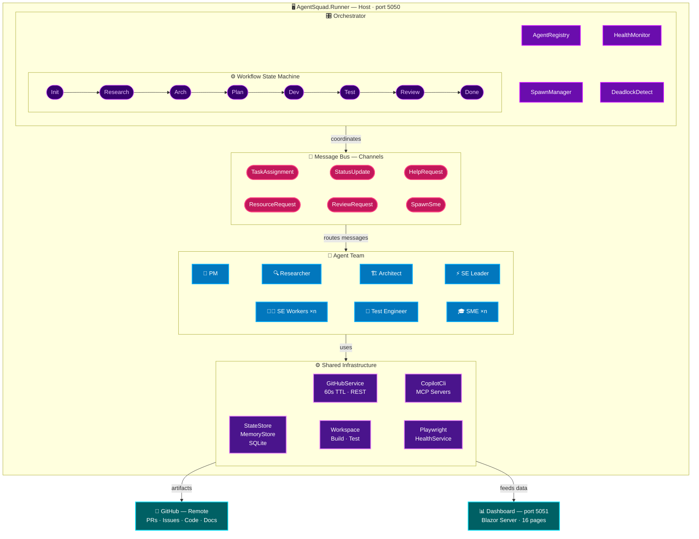
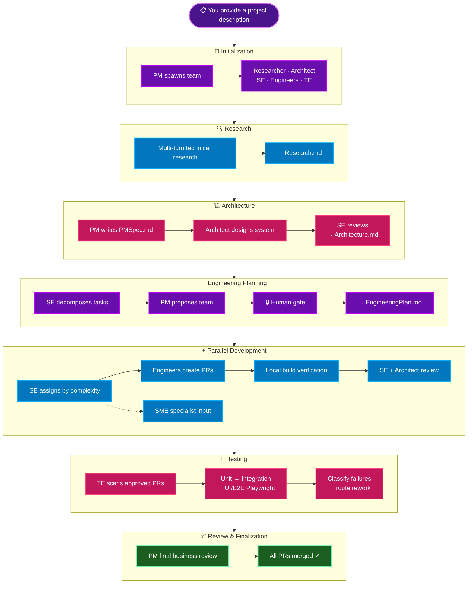
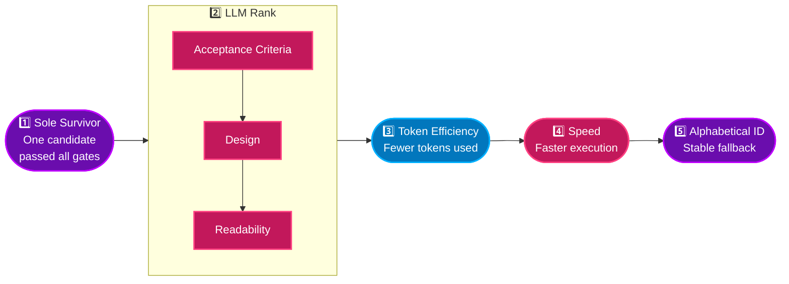

<div align="center">

# 🤖 AgentSquad

**An AI-powered autonomous development team that builds software end-to-end**

*Give it a project description — it researches, architects, plans, codes, tests, and delivers through real GitHub PRs and Issues, with human oversight at every critical gate.*

</div>

<p align="center">
  
  
  
  
</p>

---

AgentSquad is a .NET 8 multi-agent AI system that manages a full software development team — from PM through Test Engineer — to autonomously build software projects. You provide a project description and a GitHub repo; AgentSquad handles research, architecture, engineering planning, parallel implementation, multi-tier testing, code review, and delivery. Every artifact lives in GitHub as real PRs and Issues. A Blazor dashboard gives you real-time visibility, and configurable human gates let you control how much autonomy the team has.

## Key Capabilities

- **Full Development Lifecycle** — From a single project description, agents autonomously produce Research.md → PMSpec.md → Architecture.md → EngineeringPlan.md → implemented PRs → test PRs → reviewed and merged code
- **Dynamic SME Agents** — The PM and SE can spawn Subject Matter Expert agents on-demand (security auditors, database specialists, etc.) with custom personas, MCP tool servers, and external knowledge sources — driven by AI assessment of project needs. Dashboard displays specialty, capabilities, and custom-derived initials for each SME
- **Multi-Tier Test Automation** — The Test Engineer generates and runs unit tests, integration tests, and Playwright UI/E2E tests in local workspaces, with AI-powered failure classification (test bug vs source bug) and automatic retry/fix cycles
- **Self-Healing Playwright Launch Pipeline** — Every UI test and screenshot capture flows through a unified `LaunchVerifiedAppAsync` pipeline that automatically resolves agent-generated port conflicts. It patches hardcoded bindings (`app.Run`, `Listen`, `ListenAnyIP`, `Configuration["urls"]`, `ConfigureKestrel` variants, `launchSettings.json` `applicationUrl`), accepts any HTTP response as readiness (302, 401, 404 all count as "listening"), and self-heals via kill → build → restart cascades. Ports are hash-derived per workspace in the 5100–5899 range, so UI tests no longer require any specific port
- **Background Port Health Monitoring** — `PlaywrightHealthService` runs every 5 minutes as a `HostedService` — it samples ports, validates browser installs, and cleans up stale `.playwright-bak` backup files older than 1 hour. Live status is exposed via the `/health/playwright` endpoint (`OccupiedPortCount`, `LastPortCheckUtc`)
- **Human Gate Checkpoints** — Configurable gates pause workflow at critical points for human approval. Three presets (Full Auto, Supervised, Full Control) with hot-reloadable config via `IOptionsMonitor`
- **GitHub Copilot CLI as AI Backend** — All model tiers route through the `copilot` CLI binary by default — no API keys required. Process-per-request with concurrency limiting, MCP server passthrough, and automatic fallback to direct API providers
- **Agent Memory & Learning** — SQLite-backed persistent memory records agent decisions, learnings, and operator instructions. Agents recall up to 30 recent entries across restarts for context continuity
- **Vision-Based PR Review** — AI reviewers download and analyze screenshots from PR comments using base64-embedded images, catching broken UIs that text-only reviews miss
- **Local Build & Test Verification** — Agents clone repos into local workspaces and run real `dotnet build`, `dotnet test`, and Playwright commands — not just AI-generated code, but verified code
- **MCP Server Integration** — Agents can be equipped with Model Context Protocol tool servers (code search, documentation, issue tracking) that are automatically configured in the Copilot CLI's `mcp.json`
- **Knowledge Pipeline** — Agents fetch, extract, and summarize external documentation (HTML/Markdown URLs) with per-tier budget limits, injecting domain knowledge directly into system prompts
- **Custom Agent Definitions** — Define new agent roles via configuration (persona, tools, knowledge links) without writing code. The `CustomAgent` base class handles the rest
- **Externalized Prompt Templates** — All ~95 agent prompts live in editable `.md` files under `prompts/`, with YAML frontmatter metadata and `{{variable}}` substitution. Change agent behavior without recompiling — templates are loaded at runtime with in-memory caching and hardcoded fallbacks for resilience
- **Dynamic Team Scaling** — The PM analyzes project requirements and proposes an optimal team composition (agent counts, SME specialists), enforced through human gate approval
- **LLM Semantic Skill Matching** — SE leader uses budget-tier LLM calls to semantically match tasks to specialist engineers by capability, not just exact skill-tag strings. Falls back to exact-match if LLM fails
- **Per-Reviewer Rework Limits** — Rework cycles tracked per (PR, reviewer) pair. Each reviewer (Architect, SE, PM, TE) gets 1 cycle independently, so a PR with 3 reviewers gets up to 3 rounds total
- **Visual Scaffold Placeholders** — Foundation tasks for web/UI projects create components with colored backgrounds, dashed borders, and bold labels. Playwright screenshots show a clear grid of sections, never blank white
- **Crash-Resilient Sessions** — CLI session IDs persist to SQLite so agents resume the same Copilot conversation after runner restarts. SE agents recover in-memory state flags (`_allTasksComplete`, `_integrationPrCreated`, `_engineeringSignaled`) from GitHub on restart, preventing duplicate task/PR creation
- **16-Page Real-Time Dashboard** — Blazor Server UI with agent overview, project timeline, features management, agentic frameworks, metrics, health monitor, PR/issue browsers, engineering plan graph, team visualization, director CLI terminal, and approval management. Standalone mode (port 5051) provides full data via HTTP polling to the Runner API
- **Run-Scoped Task Management** — All GitHub queries (merged PRs, open PRs, open issues) are scoped to the current run via `_runStartedUtc` to prevent stale data from previous runs interfering with task assignment or overlap detection
- **Decision Impact Classification & Gating** — Agents classify decisions by impact level (XS–XL) using AI. High-impact decisions are gated for human approval before agents proceed. Configurable threshold levels, structured implementation plans for gated decisions, and a rich dashboard UI for reviewing and approving decisions
- **Agent Task Steps** — Real-time workflow visibility: all 7 agents report step-by-step progress (BeginStep/CompleteStep/RecordSubStep) with per-step timing, LLM call counts, and cost. Dashboard shows live step timelines with progress bars, expected-step templates per role, and rich tooltips with detailed context on mouseover — zero LLM overhead, pure observability
- **SE Parallelism Enhancements** — Software Engineer validates file overlap across parallel tasks, enforces wave scheduling (W1/W2/W3+) with collision-safe task IDs and cache-merge on API delay to prevent dropped tasks during rate-limit recovery, uses typed dependencies, and logs parallelism metrics. AI-assisted repair of file conflicts ensures engineers can work in parallel without merge conflicts
- **Strategy Framework (A/B/C/D Code Generation)** — The SE can generate multiple candidate implementations in parallel (baseline, mcp-enhanced, copilot-cli, squad) in isolated git worktrees, score each via an LLM judge on Acceptance Criteria / Design / Readability, and apply the winner to the PR branch. After the build gate passes, `CandidateEvaluator` captures a Playwright screenshot for each strategy candidate and commits them to `.screenshots/pr-{N}-{strategyId}.png` on the PR branch. Screenshots are displayed inline in the expandable candidate detail rows on the Frameworks dashboard page. A `<!-- winner-strategy: {key} -->` HTML comment is appended to the PR body so the dashboard can identify the winning tile. Feature-flagged via `AgentSquad.StrategyFramework.Enabled` (default OFF). Sampling policy + cost budget + optional adaptive selector built in; per-strategy cost attribution in `AgentUsageTracker`; live experiment data in `/api/strategies/*` and the `/strategies` dashboard page. Validated end-to-end against live Copilot CLI in April 2026
- **Feature Mode (WIP)** — In addition to greenfield project creation, AgentSquad supports building individual features against existing repositories. Define features via the `/features` dashboard page with title, description, acceptance criteria, base branch, and optional tech stack overrides. Each run (project or feature) is wrapped in an `ActiveRun` with a unique `RunId` — all workflow state, gates, issues, and PRs are scoped per-run. `RunCoordinator` enforces single-active-run semantics. `WorkflowProfile` abstraction provides different gate definitions, artifact paths, and agent requirements for each mode. Project Control card on the Overview page provides Start/Stop controls
- **Phase-Gated Workflow** — State machine enforces linear progression: Initialization → Research → Architecture → Planning → Development → Testing → Review → Finalization
- **SinglePRMode** — When enabled, the entire project is delivered through a single engineering task and PR, simplifying the workflow for smaller projects. PM correctly gates issue closure on positive merge evidence (at least one merged PR must exist), preventing premature closure after resets
- **GitHub-Native Coordination** — Dual-layer communication: in-process message bus (<1ms, real-time) + GitHub API (durable PRs/Issues, human-visible). All work products are real GitHub artifacts
- **Multi-Model Support** — Anthropic Claude, OpenAI GPT, Azure OpenAI, and local Ollama with four configurable tiers (premium / standard / budget / local) assigned per agent role
- **Operational Resilience** — 60s TTL API cache (~90% reduction in GitHub calls), deadlock detection via wait-for graph analysis, health monitoring with stuck-agent detection, graceful shutdown with state persistence
- **Robust Review Workflow** — Duplicate `ready-for-review` comment guard across Architect and PM reviews, inline review comments always use COMMENT event type with path hardening to land correctly on the Files-changed tab, per-reviewer rework iteration counts surfaced in review threads, and AI screenshot descriptions rendered on dashboard cards for at-a-glance review
- **Design Context Propagation** — SE implementation prompts receive the full research/spec/architecture context, and the engineering plan is validated against the design documents before tasks are assigned — so implementation stays grounded in PMSpec and Architecture decisions

## Architecture



## Quick Start

### Prerequisites

- [.NET 8 SDK](https://dotnet.microsoft.com/download/dotnet/8.0) or later
- A [GitHub Personal Access Token](https://github.com/settings/tokens) with `repo` scope
- [GitHub Copilot CLI](https://github.com/features/copilot) v1.0.18+ (default AI provider — no API keys needed)
- **Or** at least one AI provider API key as fallback:
  - [Anthropic API key](https://console.anthropic.com/) (recommended for premium tier)
  - [OpenAI API key](https://platform.openai.com/api-keys)
  - [Ollama](https://ollama.ai/) installed locally (for local/free tier)

### 1. Clone and Build

```bash
git clone <repository-url>
cd AgentSquad
dotnet build
```

### 2. Configure

Edit `src/AgentSquad.Runner/appsettings.json` with your project settings (non-secret values like project name, description, repo, model tiers, etc. are committed to git):

```json
{
  "AgentSquad": {
    "Project": {
      "Name": "my-project",
      "Description": "A brief description of what to build",
      "GitHubRepo": "owner/repo",
      "DefaultBranch": "main"
    },
    "CopilotCli": {
      "Enabled": true,
      "MaxConcurrentRequests": 4
    }
  }
}
```

**Store secrets using .NET User Secrets** (never committed to git):

```bash
cd src/AgentSquad.Runner

# Required: GitHub PAT
dotnet user-secrets set "AgentSquad:Project:GitHubToken" "github_pat_..."

# Optional: API keys (only if not using Copilot CLI)
dotnet user-secrets set "AgentSquad:Models:premium:ApiKey" "sk-ant-..."
dotnet user-secrets set "AgentSquad:Models:standard:ApiKey" "sk-ant-..."
dotnet user-secrets set "AgentSquad:Models:budget:ApiKey" "sk-..."
```

> **Note:** User secrets are stored locally at `%APPDATA%\Microsoft\UserSecrets\` (Windows) or `~/.microsoft/usersecrets/` (macOS/Linux). Run the `dotnet user-secrets set` commands on each machine. Alternatively, use environment variables with `__` as separator: `AGENTSQUAD__PROJECT__GITHUBTOKEN=github_pat_...`
```

When `CopilotCli.Enabled` is `true` (default), all model tiers route through the `copilot` binary — no API keys needed. For direct API access, configure providers per tier:

```json
{
  "AgentSquad": {
    "Models": {
      "premium":  { "Provider": "Anthropic", "Model": "claude-opus-4.7",   "ApiKey": "sk-ant-..." },
      "standard": { "Provider": "Anthropic", "Model": "claude-sonnet-4.6", "ApiKey": "sk-ant-..." },
      "budget":   { "Provider": "OpenAI",    "Model": "gpt-4o-mini",       "ApiKey": "sk-..." },
      "local":    { "Provider": "Ollama",    "Model": "qwen2.5-coder:14b",     "Endpoint": "http://localhost:11434" }
    }
  }
}
```

### 3. Run

```bash
cd src/AgentSquad.Runner
dotnet run
```

### 4. Monitor

The dashboard runs embedded at `http://localhost:5050`, or standalone:

```bash
cd src/AgentSquad.Dashboard.Host
dotnet run    # → http://localhost:5051
```

Standalone mode lets you restart the dashboard without disrupting running agents.

## How It Works



## Agent Roles

### Core Team (always present)

| Role | Tier | Responsibilities |
|------|------|------------------|
| **Program Manager** | `premium` | Orchestrates team composition, writes PMSpec with user stories, triages blockers, reviews PRs for business alignment, manages escalations to human executive |
| **Researcher** | `standard` | Multi-turn technical research, technology evaluation, feasibility analysis → produces Research.md |
| **Architect** | `premium` | System design via 5-turn AI conversation, API/data modeling, technology selection → produces Architecture.md, reviews PRs for architectural compliance |
| **Software Engineer (Leader)** | `premium` | Decomposes architecture into engineering tasks, assigns work, conducts rigorous code reviews with scoring rubrics, handles high-complexity PRs directly. The first SE (rank 0) acts as the leader. |
| **Software Engineer (Worker)** | `standard` | Implements tasks via plan → implement → self-review pipeline. Local build/test verification before PR submission. Additional SEs spawned dynamically from the SE pool. |
| **Test Engineer** | `standard` | Three-tier test generation (unit → integration → UI/E2E), testability assessment, source-bug classification, coverage tracking |

### Dynamic Specialists (spawned on-demand)

| Type | How Created | Lifecycle |
|------|-------------|-----------|
| **Custom Agents** | Defined in config with role description, MCP servers, knowledge links | Persistent — run alongside core team |
| **SME Agents** | AI-generated or from templates when specialist knowledge is needed | OnDemand, Continuous, or OneShot — retire when work completes |
| **Additional Engineers** | PM requests scaling; Orchestrator enforces limits | Persistent — fill engineer slots dynamically |

See [docs/agent-behaviors.md](docs/agent-behaviors.md) for detailed behavior documentation.

## Strategy Framework — A/B/C Code Generation & Winner Selection

When enabled (`AgentSquad.StrategyFramework.Enabled = true`), the SE generates multiple candidate implementations for each task in parallel, evaluates them through hard gates and an LLM judge, and applies the best one to the PR branch.

### Strategy Candidates

| Strategy | Description |
|----------|-------------|
| **Baseline** | Standard single-pass code generation using the SE's normal prompt pipeline |
| **MCP-Enhanced** | Augments generation with Model Context Protocol servers for richer context (e.g., file search, symbol lookup) |
| **GitHub Copilot CLI** | Full autonomous Copilot CLI session with tool access (--allow-all) |
| **Squad** | External agentic framework ([bradygaster/squad](https://github.com/bradygaster/squad)) — installed on first use, runs as `copilot --agent squad`, with automatic stuck detection and configurable timeout |

Each candidate runs in an **isolated git worktree** — a full copy of the branch at the current HEAD — so candidates cannot interfere with each other.

### Hard Gates (pass/fail)

Before any scoring, every candidate must survive four sequential gates:

1. **OutputProduced** — The candidate generated a non-empty patch
2. **Build** — The patch applies cleanly to a scratch worktree and `dotnet build` succeeds. Patches that touch reserved evaluator paths or escape the worktree are rejected
3. **AppStarts** — The application starts successfully (stub: passes for non-web tasks)
4. **EvaluatorTests** — Custom evaluator test suite passes (stub: passes when no suite configured)

Candidates that fail any gate are eliminated. If zero candidates survive, the SE falls back to legacy single-pass code generation.

### LLM Judge Scoring

Surviving candidates are scored by an LLM judge (`LlmJudge`) on three 0–10 axes:

| Axis | What It Measures |
|------|-----------------|
| **Acceptance Criteria (AC)** | How completely the code satisfies the task's acceptance criteria from the issue |
| **Design** | Architecture quality, API design, separation of concerns, pattern adherence |
| **Readability** | Code clarity, naming conventions, comment quality, consistency |

The judge receives sanitized diffs (capped at `MaxJudgePatchChars`) for all surviving candidates in a single batch call and returns structured JSON scores.

### Winner Selection & Tiebreaking

Winners are selected using a strict priority cascade:




If no LLM judge is configured, scoring is skipped and winner selection uses only the token/speed/ID tiebreakers.

### Post-Winner Flow

1. **Patch applied** — `WinnerApplyService` applies the winning patch to the PR branch via `git apply`
2. **Screenshots** — `CandidateEvaluator` captures a Playwright screenshot for each candidate and commits them to `.screenshots/pr-{N}-{strategyId}.png` on the PR branch
3. **PR annotation** — A `<!-- winner-strategy: {key} -->` HTML comment is embedded in the PR body
4. **Full review** — The PR proceeds through normal Architect → PM → TE review pipeline (configurable via `PostWinnerFlow`)
5. **Dashboard** — The `/strategies` page shows live experiment data; the Project Timeline shows per-candidate screenshot tiles with the winner highlighted in gold

### Configuration

```json
{
  "AgentSquad": {
    "StrategyFramework": {
      "Enabled": false,
      "PostWinnerFlow": "full-review",
      "Evaluator": {
        "MaxJudgePatchChars": 8000
      }
    }
  }
}
```

Per-strategy cost attribution is tracked in `AgentUsageTracker`, with live data available at `/api/strategies/*`. An optional `AdaptiveStrategySelector` learns from past experiment results to weight strategy sampling probabilities over time.

## Configuration

Configuration lives in `src/AgentSquad.Runner/appsettings.json` under the `AgentSquad` section (committed to git). Secrets (GitHub PAT, API keys) are stored separately via [.NET User Secrets](https://learn.microsoft.com/en-us/aspnet/core/security/app-secrets) and never committed.

| Section | Description |
|---------|-------------|
| `Project` | GitHub repo, PAT, project name/description, default branch, executive username |
| `CopilotCli` | Enable/disable Copilot CLI provider, max concurrent requests |
| `Models` | Model tier definitions — provider, model name, API key, endpoint, temperature, max tokens |
| `Agents` | Per-role model tier assignments, MCP servers, knowledge links, custom prompts |
| `McpServers` | Global MCP server definitions (name, command, transport, capabilities) |
| `SmeAgents` | SME templates, max instances, spawn limits, definition persistence |
| `Limits` | Max additional engineers, daily token budget, poll intervals, timeouts, concurrency |
| `Workspace` | Local build/test paths, commands, per-tier test timeouts, max retries |
| `Gates` | Human gate configuration, presets (FullAuto / Supervised / FullControl) |
| `DecisionGating` | Decision impact classification & gating — enable/disable, minimum gate level (XS–XL), plan requirements, timeouts, fallback actions |
| `Dashboard` | Dashboard port and SignalR toggle |

**Decision Gating** — classify and gate high-impact agent decisions:

```json
{
  "AgentSquad": {
    "DecisionGating": {
      "Enabled": true,
      "MinimumGateLevel": "L",
      "RequirePlanForGated": true,
      "MaxDecisionTurns": 3,
      "GateTimeoutMinutes": 0,
      "TimeoutFallbackAction": "auto-approve"
    }
  }
}
```

See [docs/setup-guide.md](docs/setup-guide.md) for a detailed walkthrough of every configuration option.

## Dashboard

The Blazor Server dashboard provides real-time visibility into the agent team with 16 pages. Runs embedded in the Runner or as a standalone process. The Frameworks page shows expandable candidate detail cards with scores, progress pipelines, metrics, and preview screenshots for each strategy candidate.

| Page | Route | Description |
|------|-------|-------------|
| **Agent Overview** | `/` | Grid of all agents with status badges, model selectors, chat, error tracking, deadlock alerts, and Project Control card with Start/Stop buttons |
| **Features** | `/features` | Define, manage, and launch feature builds against existing repos with acceptance criteria and tech stack overrides |
| **Configuration** | `/configuration` | Settings editor, gate presets, SME management, GitHub cleanup |
| **Frameworks** | `/strategies` | Live strategy framework experiment data with expandable candidate detail cards showing scores, metrics, progress pipeline, and preview screenshots |
| **Project Timeline** | `/timeline` | Visual workflow timeline with PM/Engineering views, phase grouping, PR/Issue type indicators |
| **Metrics** | `/metrics` | System health, utilization ring chart, status breakdown, longest-running tasks |
| **Health Monitor** | `/health` | Real-time health checks, stuck agent detection, system diagnostics |
| **Pull Requests** | `/pullrequests` | GitHub PR browser with state filters, labels, and branch info |
| **Issues** | `/issues` | GitHub issue browser with label/assignee filters and sorting |
| **Engineering Plan** | `/engineering-plan` | Interactive Cytoscape.js dependency graph of engineering tasks |
| **Team View** | `/team` | Visual office-metaphor layout with agent desks and connection lines |
| **Director CLI** | `/director-cli` | Terminal interface for issuing executive directives to agents |
| **Approvals** | `/approvals` | Human gate approval management with filter buttons |
| **Agent Detail** | `/agent/{id}` | Deep dive into a single agent with pause/resume/terminate controls |
| **Agent Reasoning** | `/reasoning` | View agent decision-making chains, AI conversation history, and step-by-step task progress |
| **GitHub Feed** | `/github-feed` | Live feed of GitHub activity across the project |
| **Repository** | `/repository` | Browse repository file tree and content |

## Project Structure

```
AgentSquad/
├── AgentSquad.sln
├── src/
│   ├── AgentSquad.Core/                # Shared abstractions and infrastructure
│   │   ├── Agents/                     # AgentBase, IAgent, AgentRole, AgentStatus, messages
│   │   │   └── Steps/                  # AgentTaskStep, IAgentTaskTracker, AgentStepTemplates
│   │   ├── AI/                         # CopilotCli provider, MCP config, knowledge pipeline
│   │   ├── Configuration/              # Config models, SME definitions, MCP server defs,
│   │   │                               #   WorkModels (ActiveRun, FeatureDefinition),
│   │   │                               #   WorkflowProfile (Project/Feature mode profiles)
│   │   ├── GitHub/                     # GitHubService, rate limiting, PR/Issue workflows
│   │   ├── Messaging/                  # IMessageBus, InProcessMessageBus (Channels)
│   │   ├── Persistence/                # AgentStateStore, AgentMemoryStore (SQLite)
│   │   └── Services/                   # McpServerRegistry, TeamComposer, SmeDefinitions
│   │
│   ├── AgentSquad.Agents/              # Concrete agent implementations
│   │   ├── ProgramManagerAgent.cs      # Team composition, PMSpec, blocker triage
│   │   ├── ResearcherAgent.cs          # Multi-turn technical research
│   │   ├── ArchitectAgent.cs           # System architecture design + PR review
│   │   ├── SoftwareEngineerAgent.cs   # Eng planning, task assignment, code review
│   │   ├── EngineerAgentBase.cs        # Shared engineer logic (sessions, rework, build)
│   │   ├── SoftwareEngineerAgent.cs      # Medium-complexity implementation
│   │   ├── SoftwareEngineerAgent.cs      # Low-complexity with escalation
│   │   ├── TestEngineerAgent.cs        # Multi-tier test generation + execution
│   │   ├── CustomAgent.cs              # Config-driven custom agent roles
│   │   ├── SmeAgent.cs                 # Dynamic SME specialist agents
│   │   └── AgentFactory.cs             # DI-based agent creation
│   │
│   ├── AgentSquad.Orchestrator/        # Runtime coordination
│   │   ├── AgentRegistry.cs            # Thread-safe agent lifecycle (ConcurrentDictionary)
│   │   ├── AgentSpawnManager.cs        # Dynamic spawning with slot reservation + SME limits
│   │   ├── WorkflowStateMachine.cs     # Phase-gated project progression
│   │   ├── DeadlockDetector.cs         # Wait-for graph DFS cycle detection
│   │   ├── HealthMonitor.cs            # Stuck agent detection and health snapshots
│   │   ├── GracefulShutdownHandler.cs  # Clean shutdown with state persistence
│   │   ├── DecisionGateService.cs     # AI impact classification, plan generation, gate workflow
│   │   ├── DecisionLog.cs             # Thread-safe in-memory decision storage (IDecisionLog)
│   │   ├── DecisionGatingConfig.cs    # Gate level thresholds, timeouts, fallback actions
│   │   └── RunCoordinator.cs          # Run lifecycle management, single-run enforcement
│   │
│   ├── AgentSquad.Dashboard/           # Real-time monitoring UI (shared library)
│   │   ├── Components/Pages/           # 16 Blazor pages (incl. Features, Frameworks, decision UI)
│   │   ├── Hubs/AgentHub.cs            # SignalR hub for push updates
│   │   └── Services/                   # IDashboardDataService, HttpDashboardDataService
│   │       # Dashboard decision UI: Reasoning tab filters, Approvals tab decision view,
│   │       # Overview stat card for pending/approved/rejected decisions
│   │
│   ├── AgentSquad.Dashboard.Host/      # Standalone dashboard process (port 5051)
│   └── AgentSquad.Runner/              # Application host (port 5050)
│       ├── Program.cs                  # DI setup, REST API, service registration
│       └── AgentSquadWorker.cs         # Bootstrap: spawns core agents in phased sequence
│
├── tests/
│   ├── AgentSquad.Core.Tests/          # ~395 unit tests
│   ├── AgentSquad.Agents.Tests/        # ~93 agent behavior tests
│   └── AgentSquad.Integration.Tests/   # ~66 integration tests
│
├── scripts/
│   ├── start-runner.ps1                # Start the Runner process
│   ├── stop-runner.ps1                 # Stop the Runner process
│   ├── runner-status.ps1               # Check Runner health
│   ├── start-dashboard.ps1             # Start standalone dashboard
│   ├── fresh-reset.ps1                 # Full cleanup: close PRs/Issues, delete branches, reset DB
│   ├── minimal-reset.ps1               # Mini reset — preserves startup docs (OriginalDesignConcept.html,
│   │                                   #   Research.md, PMSpec.md, Architecture.md) for fast-forward to
│   │                                   #   the engineering phase without re-running research/architecture
│   └── reset-runner.ps1                # Process-only reset (restart Runner without touching state)
│
├── prompts/                            # Externalized AI prompt templates (.md)
│   ├── researcher/                     # 10 templates (research phases, synthesis)
│   ├── pm/                             # 21 templates (specs, stories, reviews)
│   ├── architect/                      # 13 templates (architecture design, review)
│   ├── engineer-base/                  # 13 shared templates (planning, build-fix, rework)
│   ├── software-engineer/                # 2 templates (implementation, self-review)
│   ├── software-engineer/                # 1 template (implementation)
│   ├── software-engineer/             # 14 templates (plan gen, code review, integration)
│   ├── test-engineer/                  # 17 templates (test gen, tiers, failure mgmt)
│   └── custom/                         # 4 templates (task/issue processing)
│
└── docs/
    ├── Requirements.md                 # 45-section requirements with workflow scenarios
    ├── agent-behaviors.md              # Detailed per-agent behavior documentation
    ├── architecture.md                 # System architecture documentation
    ├── setup-guide.md                  # Configuration walkthrough
    ├── PromptExternalizationPlan.md    # Plan for externalizing AI prompts to templates
    ├── PEParallelismEnhancements.md    # Fleet-style parallelism enhancements
    ├── MonitorPrompt.md                # Dashboard monitoring expectations
    ├── Research.md                     # Technical research findings
    └── LessonsLearned.md              # Operational lessons from 100+ runs (60 lessons)
```

## Development

### Build

```bash
dotnet build AgentSquad.sln
```

### Test

```bash
# Run all 790+ tests
dotnet test AgentSquad.sln

# Run a specific test project
dotnet test tests/AgentSquad.Core.Tests

# Run a specific test by name
dotnet test tests/AgentSquad.Core.Tests --filter "FullyQualifiedName~McpServerRegistryTests"
```

**Offline Integration Testing (WS3)** — The `tests/` directory includes an `InMemoryGitHubService`, a `WorkflowTestHarness`, and a scripted CLI for running full agent workflow integration tests offline without hitting GitHub or real AI providers. Use this harness to validate end-to-end workflow logic locally.

### Run

```bash
cd src/AgentSquad.Runner
dotnet run
```

### Reset Scripts

Three reset levels are available depending on how much state you want to preserve:

```powershell
# Full reset — closes all PRs/Issues, deletes agent branches, removes repo files, resets SQLite DB
./scripts/fresh-reset.ps1

# Minimal reset — same cleanup, but preserves the startup design docs so the team fast-forwards
# past research/architecture. Keeps: OriginalDesignConcept.html, Research.md, PMSpec.md, Architecture.md
./scripts/minimal-reset.ps1

# Process-only reset — restarts the Runner without touching any state or GitHub artifacts
./scripts/reset-runner.ps1
```

### Health Endpoints

The Runner exposes lightweight health endpoints for monitoring and debugging:

| Endpoint | Description |
|----------|-------------|
| `/health` | Overall Runner health, agent counts, workflow phase |
| `/health/playwright` | Playwright subsystem status — `OccupiedPortCount`, `LastPortCheckUtc`, browser validity, stale `.playwright-bak` cleanup stats (refreshed every 5 minutes by `PlaywrightHealthService`) |

### Recent Changes (2025–2026)

- **Feature Mode (WIP)** — New `ActiveRun` model scopes all workflow state by `RunId`. `RunCoordinator` manages run lifecycle with single-active-run enforcement. Features dashboard page for defining, managing, and launching feature builds. Project Control card on Overview for Start/Stop. REST APIs at `/api/runs/*` and `/api/features/*`
- **Squad Framework Integration** — [bradygaster/squad](https://github.com/bradygaster/squad) added as a 4th strategy candidate alongside baseline, MCP-enhanced, and GitHub Copilot CLI. Auto-installs on first use. Configurable timeout via `SquadSeconds` (default 1800s). Stuck detection threshold 600s for long-running sub-agents
- **Framework Screenshots in Dashboard** — Expandable candidate detail rows on the Frameworks page now show preview screenshots inline (base64 PNG), with scores, progress pipeline, timing, and failure details for each strategy candidate
- **SE restart state recovery** — In-memory flags recovered from GitHub state on restart, eliminating duplicate task/PR creation
- **Premature closure prevention** — PM requires positive merge evidence (`mergedPRs.Count > 0`) before closing enhancement issues or declaring completion
- **Post-merge issue closure** — Enhancement issues correctly closed after their PR merges, with SinglePRMode closing all issues on the single PR merge
- **TE gate bypass in SinglePRMode** — PM review no longer requires TE completion comment when SinglePRMode is enabled
- **Inline review comments** — Architect and SE review comments now post as inline comments on the Files-changed tab using text-parse fallback when structured JSON output fails
- **Strategy Framework validated** — A/B/C code generation with per-candidate screenshots, winner selection, and dashboard display confirmed working end-to-end with live Copilot CLI

### Roadmap

- **Interactive CLI A/B/C testing framework** — parallel multi-option agent testing to compare prompt/model/tool variants on identical tasks. See [docs/InteractiveCLIPlan.md](docs/InteractiveCLIPlan.md) for the full design.

## Technology Stack

| Component | Technology |
|-----------|-----------|
| Runtime | .NET 8 / C# 12 |
| AI Integration | Microsoft Semantic Kernel |
| AI Providers | GitHub Copilot CLI (default), Anthropic Claude, OpenAI GPT, Azure OpenAI, Ollama |
| Tool Integration | Model Context Protocol (MCP) servers via Copilot CLI |
| GitHub Integration | Octokit.net |
| Dashboard | Blazor Server + SignalR (embedded or standalone) |
| Persistence | SQLite via Microsoft.Data.Sqlite |
| Agent Memory | SQLite-backed persistent recall (decisions, learnings, instructions) |
| Message Bus | System.Threading.Channels (bounded, in-process pub/sub) |
| Local Testing | dotnet CLI, Playwright (UI/E2E) |
| Dependency Injection | Microsoft.Extensions.DependencyInjection |
| Hosting | Microsoft.Extensions.Hosting (Generic Host) |

## License

This project is licensed under the MIT License — see the [LICENSE](LICENSE) file for details.
