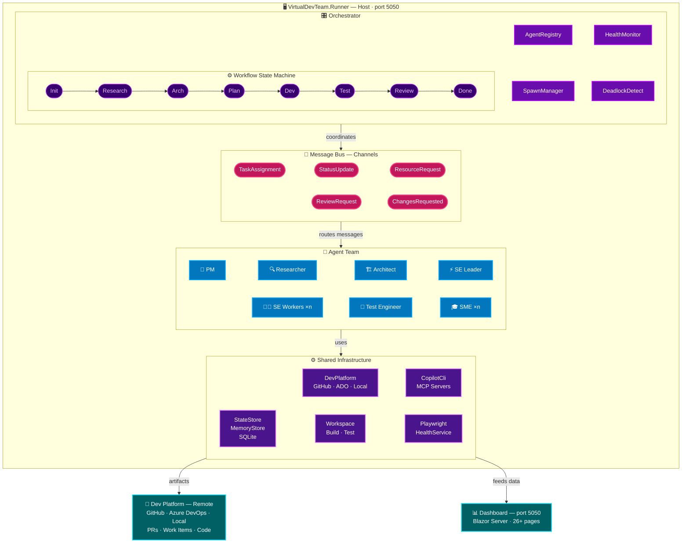
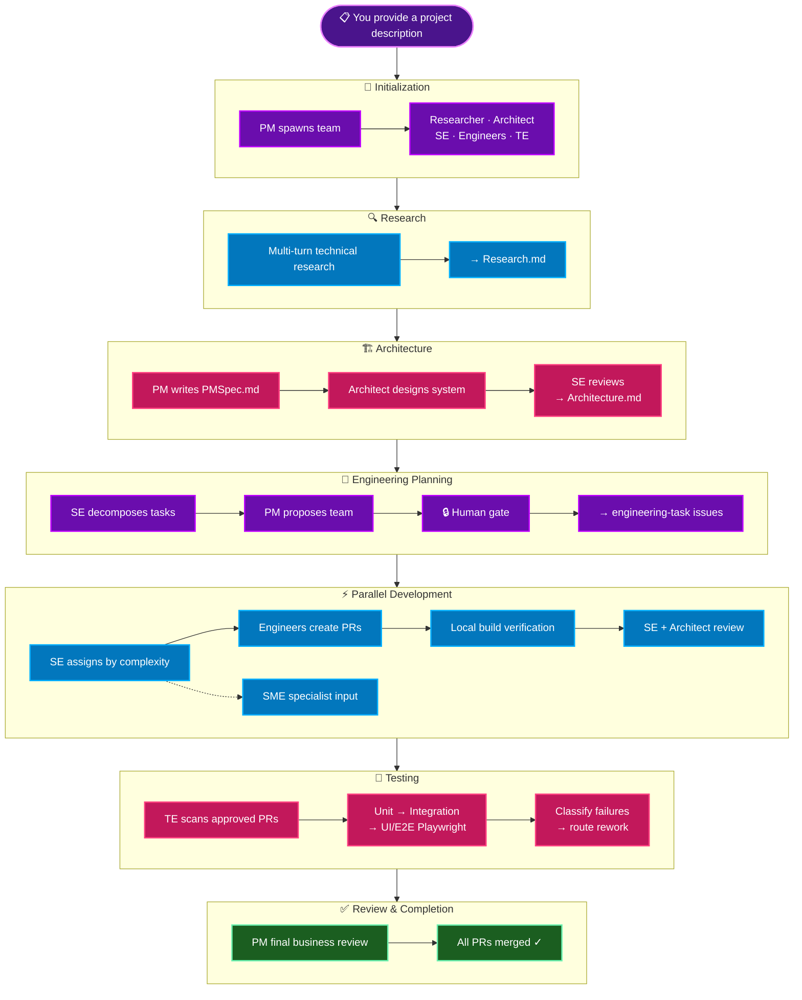
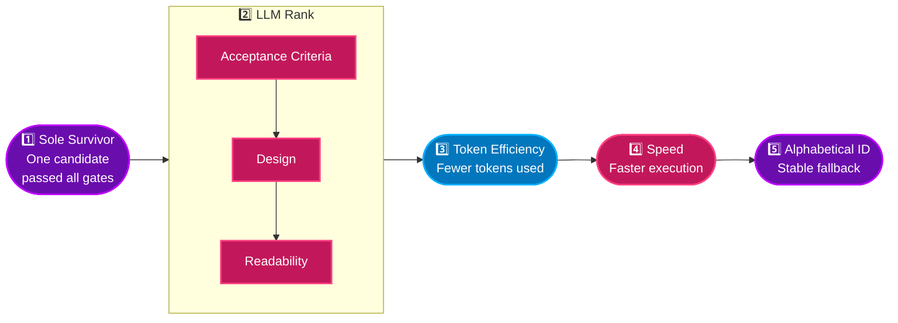

<div align="center">

# 🤖 VirtualDevTeam

**An AI-powered autonomous development team that builds software end-to-end**

*Give it a project description — it researches, architects, plans, codes, tests, and delivers through real GitHub PRs and Issues (or Azure DevOps Work Items and PRs), with human oversight at every critical gate.*

</div>

<p align="center">
  
  
  
  
</p>

---

VirtualDevTeam is a .NET 8 multi-agent AI system that manages a full software development team — from PM through Test Engineer — to autonomously build software projects. You provide a project description and a GitHub repo (or Azure DevOps project); VirtualDevTeam handles research, architecture, engineering planning, parallel implementation, multi-tier testing, code review, and delivery. Every artifact lives in your platform as real PRs and Issues/Work Items. A Blazor dashboard gives you real-time visibility, and configurable human gates let you control how much autonomy the team has.

<div align="center">

</div>

## 🚀 Getting Started

### 🥇 Recommended: Clone & run with GitHub Copilot (best experience)

The easiest path **and** always the latest code — let GitHub Copilot set everything up:

1. Create a folder, e.g. `C:\Git\VirtualDevTeam\`.
2. Open that folder in **GitHub Copilot** (CLI or VS Code) and say:
   > *"Clone this repo https://github.com/azurenerd/VirtualDevTeam and run the solution."*
3. When it's running, open your browser to **http://localhost:5050** (default port).
4. Click the **Develop** tab and start building.

**Why this is the best experience:**
- ✅ You're always on the **latest `main`** — newest features and fixes, not a release snapshot.
- 🛠️ **Easy to debug, tweak, and improve** — you're running the actual source, so you can edit prompts, set breakpoints, and see exactly what's happening.
- 🤝 **Contribute back** — found a bug or an improvement? Open a PR straight from your clone.

### Quick Install (CLI binary)

Prefer a prebuilt binary? Install the `vdt` CLI:

```powershell
# One-liner: downloads and installs the latest released vdt.exe
irm https://raw.githubusercontent.com/azurenerd/VirtualDevTeam/main/scripts/install.ps1 | iex
```

Or download the latest `vdt-win-x64.zip` from [GitHub Releases](https://github.com/azurenerd/VirtualDevTeam/releases), extract (e.g., to `%LOCALAPPDATA%\VDT`), and add it to PATH.

> ⚠️ **Heads-up:** the CLI install comes from **GitHub Releases**, so it can **lag behind the latest fixes on `main`**, and because you're running a packaged binary (not the source) it's **harder to debug, customize, or contribute improvements**. For the most up-to-date and hackable experience, use the Copilot clone-and-run path above.

### First Run (CLI)

```powershell
# Check prerequisites (gh CLI, Copilot CLI, Node.js, Git)
vdt check-deps

# Auto-install missing tools
vdt check-deps --install

# Start the dashboard
vdt start
```

Your browser opens to `http://localhost:5050` → the **Develop wizard** guides you through:
- Connecting your GitHub/Azure DevOps repo
- Pointing to your existing local checkout
- Describing what to build
- Configuring human approval gates

VDT supports three dev platform modes: GitHub, Azure DevOps, and Local. Local mode keeps PRs, reviews, work items, and merges in a local SQLite database + bare git repo, then lets you submit one clean PR to the real enterprise repo at the end.

### Workspace Mode — In-Place

VDT uses **In-Place** workspace mode: you point it at your existing local checkout and agents work directly in that repo using lightweight git worktrees. Your working tree is never touched — each agent gets its own isolated worktree branched from the current HEAD.

> **Just paste your repo path** in the wizard and go. No cloning, no duplication — agents start working immediately.

### Run from source (manual)

Already cloned the repo and prefer to do it yourself? Build & run the Runner directly:

```bash
cd src/VirtualDevTeam.Runner && dotnet run
```

> 💡 New here? Use the **Clone & run with GitHub Copilot** path at the top — it does all of this for you.

## Key Capabilities

> 📖 **See the [Interactive Walkthrough](/walkthrough) in the dashboard for a GIF-illustrated tour of every major feature.**

- **Full Development Lifecycle** — From a single project description, agents autonomously produce Research.md → PMSpec.md → Architecture.md → engineering-task issues → implemented PRs → test PRs → reviewed and merged code
- **Dynamic SME Agents** — The PM and SE can spawn Subject Matter Expert agents on-demand (security auditors, database specialists, etc.) with custom personas, MCP tool servers, and external knowledge sources — driven by AI assessment of project needs. Dashboard displays specialty, capabilities, and custom-derived initials for each SME
- **Multi-Tier Test Automation** — The Test Engineer generates and runs unit tests, integration tests, and Playwright UI/E2E tests in local workspaces, with AI-powered failure classification (test bug vs source bug) and automatic retry/fix cycles
- **Self-Healing Playwright Launch Pipeline** — Every UI test and screenshot capture flows through a unified `LaunchVerifiedAppAsync` pipeline that automatically resolves agent-generated port conflicts. It patches hardcoded bindings (`app.Run`, `Listen`, `ListenAnyIP`, `Configuration["urls"]`, `ConfigureKestrel` variants, `launchSettings.json` `applicationUrl`), accepts any HTTP response as readiness (302, 401, 404 all count as "listening"), and self-heals via kill → build → restart cascades. Ports are hash-derived per workspace in the 5100–5899 range, so UI tests no longer require any specific port
- **PlaywrightRunner Decomposition** — `PlaywrightRunner` refactored from a 4766-line monolith into a 2603-line facade delegating to extracted services: `AppLauncher` (app lifecycle, port selection), `MediaRecorder` (video, GIF, screenshots), `ApiSmokeRunner` (OpenAPI-driven API testing). `IMediaCaptureService` interface abstracts screenshot/video capture for non-workspace code. `MediaCaptureGate.ShouldCapture()` pre-flight check skips expensive MCP/video/GIF pipelines for non-UI tasks. `CaptureMode.ScreenshotOnly` mode provides lightweight captures without MCP or video
- **Background Port Health Monitoring** — `PlaywrightHealthService` runs every 5 minutes as a `HostedService` — it samples ports, validates browser installs, and cleans up stale `.playwright-bak` backup files older than 1 hour. Live status is exposed via the `/health/playwright` endpoint (`OccupiedPortCount`, `LastPortCheckUtc`)
- **Pipeline Status Snapshot API** — `GET /api/pipeline/status` returns a single-call pipeline snapshot for CLI monitoring, FlowMonitor, and external tools. It consolidates live agent state, work items, linked PR lifecycle data, dependencies, and summary metrics so operators do not need to fan out across 5+ endpoints just to answer “what is the pipeline doing right now?”
- **Pipeline Stall Detection** — `PipelineStallDetector` catches the two silent failure modes normal stuck-agent checks miss: stale `status:blocked` engineering tasks whose blocker PR already disappeared, and “everyone idle / no PRs open / claimable work still exists” stalls. This turns invisible pipeline freezes into explicit FlowMonitor findings with operator-friendly remediation.
- **FlowMonitor v2 — Always-On Watchdog** — `FlowMonitorService : BackgroundService` runs every 30s and watches the multi-agent flow for stuck states. **39 detectors** across Core and Orchestrator fire findings; **14 actions** wire to them (3-rung escalation ladder: `kick-agent-poll` → `post-explicit-ask` → `escalate-to-human`; plus specialized actions like `merge-approved-pr`, `auto-approve-gate`, `auto-approve-review`, `cancel-strategy-candidate`, `nudge-reviewer`, `close-duplicate-pr`, `clear-stale-rate-limit`). Rung-2 PR comments are disabled (log-only) — research confirmed no agent parses them, so only rung-3 human escalation is effective. Smart stuck detection uses 3× threshold for strategy framework / rework / self-assessment activities that are legitimately long-running. Global `MaxActionsPerHour=12` rate limit and 15-minute dedup window. Verification-after-action re-runs the originating detector each tick — cleared findings flip to `Resolved`, persisting ones bump severity. Hard rules: NEVER restart processes, NEVER recompile, NEVER force-merge unapproved PRs, NEVER modify code, NEVER delete platform resources. All findings + actions persisted to SQLite. Detectors get a per-tick lazy/cached `IPlatformView` so they can inspect open PRs / work items / review threads / latest commits without each detector hitting the API. Critical findings without an action handler trigger an AI-generated FixRecommendation (`/plan` + rubber-duck → operator-approval flow). The `ai-anomaly` detector itself is a single-shot LLM advisor, capped at `Warning` severity — supervisor stays deterministic; AI is advisory only
- **Real-Time FlowMonitor Log Stream** — Live event stream from FlowMonitor → browser via SignalR hub `/hubs/flowmonitor` and a bounded `Channel<FlowMonitorEvent>` (capacity 200, `DropOldest` so the runner thread never blocks on backpressure). Page `/flow-monitor-log` renders the stream in an xterm.js terminal with Copilot-CLI color classification (purple=finding, green=success, red=error, cyan=detector, gray=lifecycle). LOW/MEDIUM/HIGH verbosity selector filters client-side; events auto-tagged with `AgentCallContext.CurrentAgentId/SessionId` (AsyncLocal flow)
- **FixRecommendation Pipeline + Code-Fix Classifier** — When FlowMonitor surfaces a Critical finding without an action handler, `FixRecommendationPlannerService` runs a 2-pass Copilot CLI (`/plan` + rubber-duck critique) and saves a `.md` plan to `/FixRecommendations/{ts}-{id}.md` plus a SQLite row. `FixClassifier.Classify` heuristically tiers each plan: 🟢 **Live** (only `prompts/**/*.md`, `appsettings.json`, `develop-settings.json` — apply immediately via `LiveFixApplicator` with `git status --porcelain` snapshot diff for scope verification), 🟡 **Deferred** (`.cs`/`.razor` — apply via Copilot CLI, restart needed), 🔴 **Blocked** (`.csproj`/migrations — stage to `/FixRecommendations/staged/`, applied at next startup by `StagedFixApplicator : IHostedService`). Approvals page renders the plan via Markdig + Ganss.Xss with severity / confidence / files-touched / restart-required badges; Approve, Rework, Reject buttons
- **Warm Restart Button** — `POST /api/dashboard/runtime/restart` (and a UI button on the Health Monitor's Flow Monitor card) spawns `scripts/restart-runner.ps1` as a detached helper, then calls `IHostApplicationLifetime.StopApplication()` after a flush delay. Helper waits up to 30s for the old PID to exit, force-kills if stuck, sleeps 2s for OS file-lock release, then re-launches via `start-runner.ps1`. Workflow phase + agent identities + signals + CLI session IDs + rework counts are checkpointed to SQLite, so the new runner resumes from where the old one stopped — durable platform work (PRs, issues, branches) is unaffected. Open browser tabs auto-reload via `App.razor`'s reconnect probe
- **Per-Agent Restart Controls** — Restart an individual agent from the Agent Overview card's 🔄 button (two-click confirm) or via `POST /api/dashboard/agents/{agentId}/restart`. This is lighter than a full runner warm restart and keeps the rest of the team running
- **Agent Session Log Viewer** — Agent cards now include a `📋 Log` button that opens the live CLI session output stream for that agent, with LOW/MEDIUM/HIGH verbosity levels for quick debugging without leaving the dashboard
- **Strategy Candidate Reset Controls** — Running candidates on `/strategies` now expose a two-click `🔄` reset button. Reset kills the current process, retries from scratch in a fresh worktree, and follows the same escalation ladder as automatic stuck recovery (attempt 1 = same config, attempt 2 = `ForceNoWrapper`). Tooltips explicitly distinguish **Reset**, **Cancel**, and **Cancel All** so operators understand whether the candidate will retry or the whole task will abort. Strategy previews also now distinguish `CaptureUnavailable` (tooling/browser missing), `CaptureFailed` (the app never produced a usable preview), and `NoVisualContent` (legitimate backend-only/non-visual work) so empty tiles are diagnosable instead of ambiguous
- **Operator Change Requests** — PR detail views include an operator-driven “Add Changes” loop. Feedback is posted as a structured `**[Operator] CHANGES REQUESTED**` comment, sanitized before storage, broadcast as a `ChangesRequestedMessage`, and handled as governance rather than normal reviewer churn: operator-only rework preserves existing approvals, does not burn `MaxReworkCycles`, carries the request forward in `_implementationNotes`, and closes the loop with an `**[Operator-Addressed]**` comment when finished
- **New Story Wizard** — Timeline `+` actions can open a 3-step `NewStoryWizard` directly inside a selected wave. Operators can capture a title, description, acceptance criteria, dependencies, and AI-generated clarifying Q&A without leaving the dashboard, then create the story directly into the active backlog lane
- **Background Liveness Watchdog** — `HealthMonitor.CheckFlowMonitorLiveness()` runs at the end of each cycle. If the latest `flow_monitor_ticks.recorded_at` is staler than `2 × FlowMonitorConfig.PollIntervalSeconds`, fires a `flow-monitor:liveness` notification ONCE (guarded by an in-memory flag); recovery resolves it and clears the flag so future outages re-alert
- **Workspace Setup Skip on Cold Start** — Engineer agents probe `WorkItemService.ListByLabelAsync("engineering-task", state="open")` AND `PrService.ListOpenAsync()` filtered to their role BEFORE setting up the local workspace. If both come back empty, the agent skips workspace setup (~30s saved per agent) and goes straight to `Idle "Engineering complete from prior run — workspace not needed"`. Probe is best-effort — any platform exception falls through to normal setup
- **FlowMonitor Diagnostic Enrichment** — `IFlowDiagnosticEnricher` implementations run after detection, adding ✅/❌ diagnostic checklists to findings explaining WHY an agent is stuck (not just that it IS stuck). `PrLifecycleDiagnosticEnricher` checks PM/TE/Architect gate conditions: labels present, comments missing, dependency chain. Findings carry `Diagnostics`, `RecommendedFixId`, and `RecommendedFixDescription`. Persisted as `diagnostics_json` in `flow_findings` table; Approvals page shows diagnostics inline with collapsible details
- **Flow Monitor Dashboard** — Structured incident console at `/flow-monitor` with active-issue severity cards, collapsible Recent Changes and All Detectors sections. Replaces the xterm.js terminal (now `/flow-monitor-log`) as the primary FlowMonitor view
- **Centralized FixRecommendation Execution** — Recommendation approve/reject flows are routed through `IDiagnosticActionExecutor`, keeping the dashboard API layer thin and enforcing one allowlisted execution path for applying or dismissing FlowMonitor-generated fixes
- **PR Lifecycle Timeline** — `PrLifecycleCalculator` (in `Core/Lifecycle/`) derives merge-progress stages from labels + comments + config. `PrLifecycleTimeline.razor` renders a visual stage pipeline in PR detail popups on the Timeline page, showing exactly where a PR sits in the review→merge flow. Config-aware: adapts stages for `IsInlineTestWorkflow`, `TestEngineerReviews`, and `IsSinglePr` modes
- **Welcome Wizard** — First-time setup page at `/welcome` guiding new users through initial configuration with a step indicator and streamlined onboarding flow. Includes a humorous OSHA-style "Productivity Hazard" warning label
- **Interactive Walkthrough** — 22-GIF guided tour at `/walkthrough` covering all dashboard features. Linked from the Welcome wizard for new-user onboarding
- **Scenarios Page** — Scenario registry at `/scenarios` with an SVG progress ring showing verified/broken/inconclusive counts, project context bar, and per-scenario T-FINAL playtest status. Tracks acceptance criteria verification across the engineering pipeline. Approve/Reject/Edit actions persist to `develop-settings.json` so approval status survives runner restarts
- **Human Gate Checkpoints** — Configurable gates pause workflow at critical points for human approval. Three presets (Full Auto, Supervised, Full Control) with hot-reloadable config via `IOptionsMonitor`
- **GitHub Copilot CLI as AI Backend** — All model tiers route through the `copilot` CLI binary by default — no API keys required. Process-per-request with concurrency limiting, MCP server passthrough, and automatic fallback to direct API providers. `FreshPathResolver` reads Windows registry PATH (Machine+User) so tools installed via winget after Runner start are found without restart. Optional `CopilotCli.WrapperCommand` config prepends a wrapper binary for custom CLI auth or environments — all subprocess calls become `<wrapper> copilot ...` transparently. The wrapper liveness watchdog now probes with `pwsh` first (fallback to `powershell` only if needed) and logs startup / empty-child checks at Information level so wrapper freezes are visible in production logs
- **Agent Memory & Learning** — SQLite-backed persistent memory records agent decisions, learnings, and operator instructions. Agents recall up to 30 recent entries across restarts for context continuity
- **Vision-Based PR Review** — AI reviewers download and analyze screenshots from PR comments using base64-embedded images, catching broken UIs that text-only reviews miss
- **Local Build & Test Verification** — Agents work in local worktrees and run real `dotnet build`, `dotnet test`, and Playwright commands — not just AI-generated code, but verified code
- **MCP Server Integration** — Agents can be equipped with Model Context Protocol tool servers (code search, documentation, issue tracking) that are automatically configured in the Copilot CLI's `mcp.json`
- **Knowledge Pipeline** — Agents fetch, extract, and summarize external documentation (HTML/Markdown URLs) with per-tier budget limits, injecting domain knowledge directly into system prompts
- **Custom Agent Definitions** — Define new agent roles via configuration (persona, tools, knowledge links) without writing code. The `CustomAgent` base class handles the rest
- **Externalized Prompt Templates** — All ~100 agent prompts live in editable `.md` files under `prompts/`, with YAML frontmatter metadata and `{{variable}}` substitution. Change agent behavior without recompiling — templates are loaded at runtime with in-memory caching and hardcoded fallbacks for resilience
- **Dynamic Team Scaling** — The PM analyzes project requirements and proposes an optimal team composition (agent counts, SME specialists), enforced through human gate approval
- **LLM Semantic Skill Matching** — SE leader uses budget-tier LLM calls to semantically match tasks to specialist engineers by capability, not just exact skill-tag strings. Falls back to exact-match if LLM fails
- **Per-Reviewer Rework Limits** — Rework cycles tracked per (PR, reviewer) pair. Each reviewer (Architect, SE, PM, TE) gets 1 cycle independently, so a PR with 3 reviewers gets up to 3 rounds total
- **Pre-Publish Self-Assessment** — Before marking PRs ready-for-review, engineer agents re-read the original issue requirements with a fresh AI context window and return a JSON verdict (PASS / NEEDS_CHANGES). On failure, up to 2 surgical fix attempts are made automatically. Implementation handoff notes preserve key decisions from the coding phase so the assessment understands *why* choices were made
- **Iterative Clarifying Questions** — Develop wizard generates initial clarifying questions, then "Ask More" adds follow-up rounds with dedup and token-overlap filtering. "Regenerate" replaces all questions with a browser confirmation to prevent accidental answer loss
- **Visual Scaffold Placeholders** — Foundation tasks for web/UI projects create components with colored backgrounds, dashed borders, and bold labels. Playwright screenshots show a clear grid of sections, never blank white
- **Crash-Resilient Sessions** — CLI session IDs persist to SQLite so agents resume the same Copilot conversation after runner restarts. SE agents recover in-memory state flags (`_allTasksComplete`, `_integrationPrCreated`, `_engineeringSignaled`) from GitHub on restart, preventing duplicate task/PR creation. Past-implementation PRs (with reviewer labels) are correlated to tasks via linked work items and title matching, automatically closing stale work items on recovery
- **Repository Files Browser** — GitHub-style file tree navigation at `/repository/files` with breadcrumbs, directory listing (folders first), syntax-highlighted content viewer, binary detection, and deep-linking via catch-all route parameters. Works with both GitHub and ADO via `IRepositoryContentService`
- **26-Page Real-Time Dashboard** — Blazor Server UI with agent overview, project timeline, features management, agentic frameworks, scenarios tracking, metrics, health monitor, flow monitor dashboard, flow monitor log, PR/issue browsers, team visualization, director CLI terminal, approval management, repository files browser, a **Welcome wizard** for first-time setup, an **Interactive Walkthrough** tour, and a **Develop wizard** for guided project setup. All pages served from the Runner process on port 5050 with direct in-process access to all services
- **Run-Scoped Task Management** — All GitHub queries (merged PRs, open PRs, open issues) are scoped to the current run via `_runStartedUtc` to prevent stale data from previous runs interfering with task assignment or overlap detection
- **Decision Impact Classification & Gating** — Agents classify decisions by impact level (XS–XL) using AI. High-impact decisions are gated for human approval before agents proceed. Configurable threshold levels, structured implementation plans for gated decisions, and a rich dashboard UI for reviewing and approving decisions
- **Agent Task Steps** — Real-time workflow visibility: all 7 agents report step-by-step progress (BeginStep/CompleteStep/RecordSubStep) with per-step timing, LLM call counts, and cost. Dashboard shows live step timelines with progress bars, expected-step templates per role, and rich tooltips with detailed context on mouseover — zero LLM overhead, pure observability
- **LLM Call Context** — When agents make AI calls, the dashboard shows descriptive context (e.g., "Creating architecture design", "Generating PMSpec — Pass 1") instead of generic "AI call in progress". Agents set `AgentCallContext.CurrentCallContext` before LLM calls; auto-extracted from chat history as fallback
- **Run Switching** — Start a new project run even when a previous run is paused. The wizard auto-cancels the paused run, creates a fresh database, and reconfigures all services. Previous run databases are preserved for potential resumption. Cancel API at `/api/runs/cancel`
- **SE Parallelism Enhancements** — Software Engineer validates file overlap across parallel tasks, enforces wave scheduling (W1/W2/W3+) with collision-safe task IDs and cache-merge on API delay to prevent dropped tasks during rate-limit recovery, uses typed dependencies, and logs parallelism metrics. AI-assisted repair of file conflicts ensures engineers can work in parallel without merge conflicts
- **Strategy Framework (Multi-Candidate Code Generation)** — The SE generates multiple candidate implementations in parallel (copilot-cli, squad) in isolated git worktrees, scores each via an LLM judge on Acceptance Criteria / Design / Readability, and applies the winner to the PR branch. After the build gate passes, `CandidateEvaluator` captures Playwright screenshots and records video/GIF for each strategy candidate. A `<!-- winner-strategy: {key} -->` HTML comment is appended to the PR body so the dashboard can identify the winning tile. The T-FINAL integration PR also uses the strategy framework (falls back to legacy single-shot LLM if no winner). **Enabled by default.** Includes early screenshot emission per-candidate, evaluation progress events, configurable gate retry, per-task cancellation via `OrchestrationCancellationService`, visual scores + binary-quality gate in winner selection, and a dashboard cancel/reset button with escalation ladder. Sampling policy + cost budget + optional adaptive selector built in; per-strategy cost attribution in `AgentUsageTracker`; live experiment data in `/api/strategies/*` and the `/strategies` dashboard page
- **Strategy Recovery** — `StrategyRecoveryStore` provides SQLite-backed checkpoint persistence for the strategy framework. After each candidate is executed, a checkpoint is written with the candidate patch, scores, and base SHA. On restart, `TryRecoverFromCheckpointAsync` resumes evaluation if the `baseSha` matches the current HEAD — saving 5–20 minutes per task by avoiding re-execution of expensive strategy candidates
- **Feature Mode** — In addition to greenfield project creation, VirtualDevTeam supports building individual features against existing repositories. Define features via the `/features` dashboard page with title, description, acceptance criteria, base branch, and optional tech stack overrides. Each run (project or feature) is wrapped in an `ActiveRun` with a unique `RunId` — all workflow state, gates, issues, and PRs are scoped per-run. `RunCoordinator` enforces single-active-run semantics. `WorkflowProfile` abstraction provides different gate definitions, artifact paths, and agent requirements for each mode. Project Control card on the Overview page provides Start/Stop controls
- **Phase-Gated Workflow** — State machine enforces linear progression: Initialization → Research → Architecture → Planning → Development → Testing → Review → Completion
- **Multi-Platform Support** — Works with GitHub (default), Azure DevOps, or Local enterprise mode through the same capability interfaces (`IPullRequestService`, `IWorkItemService`, `IReviewService`, etc.). In Local mode, PRs, reviews, work items, and merges live in a local SQLite database + bare git repo, preserving the same dashboard experience and yielding one clean PR for the real enterprise repo at completion. Local mode now also auto-populates real per-file patch text for reviewers such as `SecurityAuditor` and falls back to a rebase-on-conflict merge path in `LocalBareRepoManager`, bringing LocalDevPlatform behavior closer to GitHub. ADO support includes PAT and Azure CLI bearer token auth, Work Items (Task/Bug/User Story), WIQL queries, Git Pushes API, PR threads, and native PR-to-task linking in the Development section
- **SinglePRMode** — When enabled, the entire project is delivered through a single engineering task and PR, simplifying the workflow for smaller projects. PM correctly gates issue closure on positive merge evidence (at least one merged PR must exist), preventing premature closure after resets
- **GitHub-Native Coordination** — Dual-layer communication: in-process message bus (<1ms, real-time) + platform API (durable PRs/Work Items, human-visible). All work products are real platform artifacts on GitHub or Azure DevOps
- **Multi-Model Support** — Anthropic Claude, OpenAI GPT, Azure OpenAI, and local Ollama with four configurable tiers (premium / standard / budget / local) assigned per agent role
- **Reasoning Level Validation** — Configuration dropdown for reasoning effort (`low`/`medium`/`high`) filtered per model capabilities, preventing invalid combinations. Default reasoning level is `high`; default fast-mode model is `claude-haiku-4.5`
- **Operational Resilience** — 60s TTL API cache (~90% reduction in GitHub calls), deadlock detection via wait-for graph analysis, health monitoring with stuck-agent detection, graceful shutdown with state persistence
- **Robust Review Workflow** — Duplicate `ready-for-review` comment guard across Architect and PM reviews, inline review comments always use COMMENT event type with path hardening to land correctly on the Files-changed tab, per-reviewer rework iteration counts surfaced in review threads, and AI screenshot descriptions rendered on dashboard cards for at-a-glance review
- **Design Context Propagation** — SE implementation prompts receive the full research/spec/architecture context, and the engineering plan is validated against the design documents before tasks are assigned — so implementation stays grounded in PMSpec and Architecture decisions

## Architecture


```mermaid
flowchart TB
    subgraph Runner["🖥️ VirtualDevTeam.Runner — Host · port 5050"]
        direction TB

        subgraph Orch["🎛️ Orchestrator"]
            direction TB
            AR[AgentRegistry] ~~~ SM[SpawnManager]
            HM[HealthMonitor] ~~~ DD[DeadlockDetect]
            subgraph WSM["⚙️ Workflow State Machine"]
                direction LR
                W1([Init]) --> W2([Research]) --> W3([Arch]) --> W4([Plan])
                W4 --> W5([Dev]) --> W6([Test]) --> W7([Review]) --> W8([Done])
            end
        end

        subgraph Bus["📡 Message Bus — Channels"]
            direction LR
            M1([TaskAssignment]) ~~~ M2([StatusUpdate]) ~~~ M3([ResourceRequest])
            M4([ReviewRequest]) ~~~ M5([ChangesRequested])
        end

        subgraph Team["👥 Agent Team"]
            direction LR
            PM["🎯 PM"] ~~~ RS["🔍 Researcher"] ~~~ ARC["🏗️ Architect"] ~~~ SE["⚡ SE Leader"]
            SEW["👨‍💻 SE Workers ×n"] ~~~ TE["🧪 Test Engineer"] ~~~ SME["🎓 SME ×n"]
        end

        subgraph Infra["⚙️ Shared Infrastructure"]
            direction LR
            DVP["DevPlatform<br/>GitHub · ADO · Local"] ~~~ CCS["CopilotCli<br/>MCP Servers"]
            DB["StateStore<br/>MemoryStore<br/>SQLite"] ~~~ WK["Workspace<br/>Build · Test"] ~~~ PW["Playwright<br/>HealthService"]
        end
    end

    PLT["🔀 Dev Platform — Remote<br/>GitHub · Azure DevOps · Local<br/>PRs · Work Items · Code"]
    DASH["📊 Dashboard — port 5050<br/>Blazor Server · 26+ pages"]

    Orch -->|coordinates| Bus
    Bus -->|routes messages| Team
    Team -->|uses| Infra
    Infra -->|artifacts| PLT
    Infra -->|feeds data| DASH

    classDef purple fill:#6a0dad,stroke:#bf00ff,stroke-width:2px,color:#fff
    classDef pink fill:#c2185b,stroke:#ff4081,stroke-width:2px,color:#fff
    classDef blue fill:#0277bd,stroke:#00b0ff,stroke-width:2px,color:#fff
    classDef deepPurple fill:#4a148c,stroke:#ea80fc,stroke-width:2px,color:#fff
    classDef cyan fill:#006064,stroke:#00e5ff,stroke-width:2px,color:#fff
    classDef phase fill:#37006e,stroke:#d050ff,stroke-width:1px,color:#e8c0ff

    class AR,SM,HM,DD purple
    class W1,W2,W3,W4,W5,W6,W7,W8 phase
    class M1,M2,M3,M4,M5,M6 pink
    class PM,RS,ARC,SE,SEW,TE,SME blue
    class DVP,CCS,DB,WK,PW deepPurple
    class PLT,DASH cyan
```

## Quick Start

### Prerequisites

> 💡 **Easiest — install prerequisites from the dashboard.** Once VDT is running, open the **[`/welcome`](http://localhost:5050/welcome)** page — it checks every prerequisite below and **installs any that are missing with one click**, so you don't have to run the commands by hand. (The `vdt check-deps --install` CLI command does the same from the terminal.)

| Requirement | Version | Purpose | Install |
|-------------|---------|---------|---------|
| [.NET 8 SDK](https://dotnet.microsoft.com/download/dotnet/8.0) | 8.0+ | Build & run VirtualDevTeam | `winget install Microsoft.DotNet.SDK.8` |
| [Git](https://git-scm.com/) | 2.x+ | Source control | `winget install Git.Git` |
| [GitHub CLI (`gh`)](https://cli.github.com/) | 2.x+ | GitHub auth & Copilot CLI host | `winget install GitHub.cli` |
| [GitHub Copilot CLI](https://github.com/features/copilot) | 1.0.18+ | Default AI provider (no API keys needed) | `gh extension install github/gh-copilot` |
| [Node.js](https://nodejs.org/) | **22.5+** | Required by Squad strategy framework | `winget install OpenJS.NodeJS` |
| [npm](https://www.npmjs.com/) | 10+ | Package manager (ships with Node.js) | Included with Node.js |

**Optional (for specific features):**

| Requirement | Purpose | Install |
|-------------|---------|---------|
| [Ollama](https://ollama.ai/) | Local/free AI tier | `winget install Ollama.Ollama` |
| [FFmpeg](https://ffmpeg.org/) | Animated GIF UI test captures | `choco install ffmpeg` or download to `C:\Tools\ffmpeg\` |
| [Anthropic API key](https://console.anthropic.com/) | Direct API access (premium tier fallback) | Sign up at console.anthropic.com |
| [OpenAI API key](https://platform.openai.com/api-keys) | Direct API access (budget tier fallback) | Sign up at platform.openai.com |

### 1. Verify Prerequisites

```powershell
# Check all required tools are installed
dotnet --version        # Should be 8.0.x or higher
gh --version            # Should be 2.x+
gh auth status          # Should show "Logged in to github.com"
copilot --version       # Should be 1.0.18+
node --version          # Should be v22.5.0+
npm --version           # Should be 10+

# Optional — check ffmpeg for GIF/video generation
ffmpeg -version         # If missing, install: winget install ffmpeg
```

If `gh auth status` shows you're not logged in:

```powershell
gh auth login           # Follow interactive prompts — choose GitHub.com, HTTPS, browser auth
```

### 2. Clone and Build

```bash
git clone <repository-url>
cd VirtualDevTeam
dotnet build
```

### 2a. First-Run Setup — Local Config Files

VirtualDevTeam commits **template** versions of three local config files that are otherwise gitignored so per-developer state doesn't leak across the team. On first clone, copy each template to its working name and customise as needed:

```powershell
cd src/VirtualDevTeam.Runner
Copy-Item develop-settings.template.json develop-settings.json   # Wizard populates this automatically — copy only if you'll bypass /develop
Copy-Item preview-settings.template.json preview-settings.json   # Preview-build clone path (Testing page); empty default is fine until you use it
Copy-Item sme-definitions.template.json  sme-definitions.json    # Optional — runner creates this on demand if absent
```

All three working copies are gitignored — your local edits stay on your machine.

### 3. Authentication — Use CLI / MCP, NOT PATs

> **🔒 Default policy: VirtualDevTeam never stores GitHub or Azure DevOps PATs on disk.** Auth is brokered at runtime via the platform CLIs (`gh`, `az`) — which also drive the [GitHub MCP server](https://github.com/github/github-mcp-server) and [Azure DevOps MCP server](https://github.com/microsoft/azure-devops-mcp) that Copilot CLI agents use for tool calls. This works correctly with Enterprise Managed User (EMU) accounts where PAT creation is org-blocked.

**For GitHub (default — works out of the box):**

```powershell
gh auth login                # one-time interactive login; choose HTTPS + browser
gh auth status               # confirm: "Logged in to github.com as <you>"
```

The runner's auth provider is `GhCli` by default (see `appsettings.json` → `DevPlatform.AuthMethod`). It calls `gh auth token` every time it needs a token — there is **nothing to copy into a config file or user-secrets entry**. When `gh` rotates the token, the runner picks up the new one on the next call automatically.

**For Azure DevOps:**

```powershell
az login                     # one-time interactive login
az account show              # confirm subscription
```

In the Develop wizard, choose `AzureCliBearer` as the auth method. The runner's `AzureCliBearerProvider` calls `az account get-access-token` and auto-refreshes 5 minutes before expiry. Like GhCli, **nothing is stored on disk**.

**MCP server access (Copilot CLI agents):**

When Copilot CLI starts with `--allow-all` (how the runner spawns it), the agent automatically connects to:
- **GitHub MCP server** — uses your `gh` session for repo / PR / issue tools
- **Azure DevOps MCP server** — uses your `az` session for work-item / pipeline tools

No PATs needed. No config files needed. Just keep `gh` and `az` logged in.

#### Fallback: PAT setup (NOT recommended)

Only use this path if `gh`/`az` are unavailable (e.g. air-gapped CI). PATs go into `dotnet user-secrets` so they **never enter the tracked file tree**, but a leaked secret store is still a security risk that the CLI paths eliminate entirely.

```powershell
cd src/VirtualDevTeam.Runner
# GitHub PAT — only if you can't use `gh auth login`
dotnet user-secrets set "VirtualDevTeam:Project:GitHubToken" "github_pat_..."
# Azure DevOps PAT — only if you can't use `az login`
dotnet user-secrets set "VirtualDevTeam:DevPlatform:AzureDevOps:Pat" "..."
```

Then switch `DevPlatform.AuthMethod` to `Pat` in your `develop-settings.json`.

> **User Secrets** live at `%APPDATA%\Microsoft\UserSecrets\` (Windows) / `~/.microsoft/usersecrets/` (macOS+Linux) — outside the repo. They never get committed but they DO leak between users on the same machine and don't auto-rotate. Prefer the CLI paths above.

**Optional: LLM API keys** (only needed if you disable Copilot CLI):

Copilot CLI is the default AI provider (`CopilotCli.Enabled=true`) — agents call the `copilot` binary which uses your GitHub Copilot subscription. You only need direct API keys if you set `CopilotCli.Enabled=false`:

```powershell
dotnet user-secrets set "VirtualDevTeam:Models:premium:ApiKey" "sk-ant-..."    # Anthropic
dotnet user-secrets set "VirtualDevTeam:Models:standard:ApiKey" "sk-ant-..."   # Anthropic
dotnet user-secrets set "VirtualDevTeam:Models:budget:ApiKey" "sk-..."         # OpenAI
```

### 4. Configure via Develop Wizard (Recommended)

The **Develop wizard** in the dashboard provides a guided setup experience. Start the Runner, then navigate to **http://localhost:5050/develop**. The wizard walks through:

1. **What to Build** — Project name, description, work item generation mode (broken-out vs single user story, single vs multiple PRs)
2. **Repo & Auth** — Platform selection (GitHub, Azure DevOps, or Local), auth method (when applicable), repository setup
3. **Human Gates** — Configure human review checkpoints with quick presets (Full Auto / Supervised / Full Control), common gates (PM Spec, Architecture, SME Spawn, Final PR), advanced per-phase gates, and agent reviewer toggles (PM, Architect, Engineers)
4. **Work Items** — Search and select a parent work item to scope the run
5. **Review** — Confirm settings and launch the agent team. Supports run switching — start a new run even if a previous one is paused (auto-cancels the old run)

Choose `Local` here for enterprise mode, or set `devPlatformKind: "Local"` in `develop-settings.json` if you're configuring manually.

### 5. Configure Project Settings (Optional — Develop wizard handles this)

If not using the Develop wizard, edit `src/VirtualDevTeam.Runner/appsettings.json` with your project settings (non-secret values — committed to git):

```json
{
  "VirtualDevTeam": {
    "Project": {
      "Name": "my-project",
      "Description": "A brief description of what to build",
      "GitHubRepo": "owner/repo",
      "DefaultBranch": "main"
    },
    "CopilotCli": {
      "Enabled": true,
      "MaxConcurrentRequests": 4
    }
  }
}
```

When `CopilotCli.Enabled` is `true` (default), all model tiers route through the `copilot` binary — no API keys needed. For direct API access, configure providers per tier:

```json
{
  "VirtualDevTeam": {
    "Models": {
      "premium":  { "Provider": "Anthropic", "Model": "claude-opus-4.7",   "ApiKey": "USE_USER_SECRETS" },
      "standard": { "Provider": "Anthropic", "Model": "claude-sonnet-4.6", "ApiKey": "USE_USER_SECRETS" },
      "budget":   { "Provider": "OpenAI",    "Model": "gpt-5-mini",         "ApiKey": "USE_USER_SECRETS" },
      "local":    { "Provider": "Ollama",    "Model": "qwen2.5-coder:14b", "Endpoint": "http://localhost:11434" }
    }
  }
}
```

> **⚠️ Never put API keys in `appsettings.json`** — always use `dotnet user-secrets set` as shown above.

### 6. Run

```powershell
# Option A: Run directly
cd src/VirtualDevTeam.Runner
dotnet run

# Option B: Use the PowerShell scripts (recommended — runs as background process)
./scripts/start-runner.ps1      # Starts Runner on port 5050 (includes full dashboard)
```

> ⚠️ Run `scripts/start-runner.ps1` from **PowerShell 7+ (`pwsh`)**. Windows PowerShell 5.1 can freeze wrapper-based Copilot sessions before `copilot.exe` ever spawns, so the script now hard-fails on PS < 7.

### 7. Monitor

The dashboard runs at `http://localhost:5050` — all 26 pages are served directly by the Runner process with real-time data access.

Navigate to the **Develop** page (`/develop`) for guided project setup and run initiation, or the **Overview** page (`/`) for real-time agent monitoring.

> 💡 **Standalone mode (optional):** For remote monitoring or independent UI restarts, run `cd src/VirtualDevTeam.Dashboard.Host && dotnet run` — this connects to the Runner API and serves the dashboard on port 5051.

### Port Reference

| Port | Service | Notes |
|------|---------|-------|
| `5050` | Runner (API + full dashboard) | Single process, all 26 pages |
| `5051` | Standalone Dashboard | Optional, for remote/independent UI |
| `5100–5899` | Playwright test apps | Hash-derived per workspace, auto-managed |
| `11434` | Ollama | Only if using local AI tier |

## Squad Framework Setup

The [Squad](https://github.com/bradygaster/squad) framework is an external agentic coding tool that VirtualDevTeam can use as one of its strategy candidates (alongside Baseline, MCP-Enhanced, and Copilot CLI). Squad is **auto-installed on first use** if the Strategy Framework is enabled — no manual setup required.

### Prerequisites for Squad

Squad requires all of the following to be installed and configured:

```powershell
# Verify Squad prerequisites
node --version          # Must be v22.5.0+ (Squad uses modern Node.js features)
npm --version           # Must be 10+
gh auth status          # Must be authenticated to GitHub
copilot --version       # Must have Copilot CLI installed
```

### How Squad Gets Installed

When `VirtualDevTeam.StrategyFramework.Enabled` is `true` and a task runs the Squad strategy:

1. **`SquadReadinessChecker`** verifies all prerequisites (Node.js, npm, gh, copilot)
2. If the `squad` CLI is not found, it installs globally: `npm install -g @bradygaster/squad-cli`
3. Squad runs as `copilot --agent squad` with the task prompt piped in
4. Stuck detection kills Squad if no output for 600 seconds (configurable)
5. Results are captured and evaluated alongside other strategy candidates

### Manual Squad Installation (optional)

```powershell
npm install -g @bradygaster/squad-cli
squad --version         # Verify installation
```

### Squad Configuration

```json
{
  "VirtualDevTeam": {
    "StrategyFramework": {
      "Enabled": true,
      "SquadSeconds": 1800,
      "Evaluator": {
        "MaxJudgePatchChars": 8000
      }
    }
  }
}
```

| Setting | Default | Description |
|---------|---------|-------------|
| `StrategyFramework.Enabled` | `true` | Enable multi-candidate strategy comparison (includes Squad) |
| `SquadSeconds` | `1800` | Max seconds for Squad to complete a task |
| Stuck detection | `600s` | Kills Squad if no stdout for this duration |

## How It Works


```mermaid
flowchart TB
    START(["📋 You provide a project description"])

    subgraph INIT["🚀 Initialization"]
        direction LR
        I1["PM spawns team"] --> I2["Researcher · Architect<br/>SE · Engineers · TE"]
    end

    subgraph RESEARCH["🔍 Research"]
        direction LR
        R1["Multi-turn technical research"] --> R2["→ Research.md"]
    end

    subgraph ARCHITECTURE["🏗️ Architecture"]
        direction LR
        A1["PM writes PMSpec.md"] --> A2["Architect designs system"] --> A3["SE reviews<br/>→ Architecture.md"]
    end

    subgraph PLANNING["📝 Engineering Planning"]
        direction LR
        P1["SE decomposes tasks"] --> P2["PM proposes team"]
        P2 --> P3["🔒 Human gate"] --> P4["→ engineering-task issues"]
    end

    subgraph DEV["⚡ Parallel Development"]
        direction LR
        D1["SE assigns by complexity"] --> D2["Engineers create PRs"]
        D2 --> D3["Local build verification"] --> D4["SE + Architect review"]
        D1 -.-> D5["SME specialist input"]
    end

    subgraph TEST["🧪 Testing"]
        direction LR
        T1["TE scans approved PRs"] --> T2["Unit → Integration<br/>→ UI/E2E Playwright"]
        T2 --> T3["Classify failures<br/>→ route rework"]
    end

    subgraph FINAL["✅ Review & Completion"]
        direction LR
        F1["PM final business review"] --> F2["All PRs merged ✓"]
    end

    START --> INIT --> RESEARCH --> ARCHITECTURE
    ARCHITECTURE --> PLANNING --> DEV --> TEST --> FINAL

    classDef start fill:#4a148c,stroke:#ea80fc,stroke-width:2px,color:#fff
    classDef purple fill:#6a0dad,stroke:#bf00ff,stroke-width:2px,color:#fff
    classDef pink fill:#c2185b,stroke:#ff4081,stroke-width:2px,color:#fff
    classDef blue fill:#0277bd,stroke:#00b0ff,stroke-width:2px,color:#fff
    classDef green fill:#1b5e20,stroke:#69f0ae,stroke-width:2px,color:#fff

    class START start
    class I1,I2,P1,P2,P3,P4 purple
    class R1,R2,D1,D2,D3,D4,D5 blue
    class A1,A2,A3,T1,T2,T3 pink
    class F1,F2 green
```

## Agent Roles

### Core Team (always present)

| Role | Tier | Responsibilities |
|------|------|------------------|
| **Program Manager** | `premium` | Orchestrates team composition, writes PMSpec with user stories, triages blockers, reviews PRs for business alignment, manages escalations to human executive |
| **Researcher** | `standard` | Multi-turn technical research, technology evaluation, feasibility analysis → produces Research.md |
| **Architect** | `premium` | System design via 5-turn AI conversation, API/data modeling, technology selection → produces Architecture.md, reviews PRs for architectural compliance |
| **Software Engineer (Leader)** | `premium` | Decomposes architecture into engineering tasks, assigns work, conducts rigorous code reviews with scoring rubrics, handles high-complexity PRs directly. The first SE (rank 0) acts as the leader. |
| **Software Engineer (Worker)** | `standard` | Implements tasks via plan → implement → self-review pipeline. Local build/test verification before PR submission. Additional SEs spawned dynamically from the SE pool. |
| **Test Engineer** | `standard` | Three-tier test generation (unit → integration → UI/E2E), testability assessment, source-bug classification, coverage tracking |

### Dynamic Specialists (spawned on-demand)

| Type | How Created | Lifecycle |
|------|-------------|-----------|
| **Custom Agents** | Defined in config with role description, MCP servers, knowledge links | Persistent — run alongside core team |
| **SME Agents** | AI-generated or from templates when specialist knowledge is needed | OnDemand, Continuous, or OneShot — retire when work completes |
| **Additional Engineers** | PM requests scaling; Orchestrator enforces limits | Persistent — fill engineer slots dynamically |

See [docs/system/agent-behaviors.md](docs/system/agent-behaviors.md) for detailed behavior documentation.

## Strategy Framework — Multi-Candidate Code Generation & Winner Selection

When enabled (`VirtualDevTeam.StrategyFramework.Enabled = true`), the SE generates multiple candidate implementations for each task in parallel, evaluates them through hard gates and an LLM judge, and applies the best one to the PR branch.

### Strategy Candidates

| Strategy | Description |
|----------|-------------|
| **GitHub Copilot CLI** | Full autonomous Copilot CLI session with tool access (--allow-all) |
| **Squad** | External agentic framework ([bradygaster/squad](https://github.com/bradygaster/squad)) — installed on first use, runs as `copilot --agent squad`, with automatic stuck detection and configurable timeout |

Each candidate runs in an **isolated git worktree** — a full copy of the branch at the current HEAD — so candidates cannot interfere with each other.

### Hard Gates (pass/fail)

Before any scoring, every candidate must survive four sequential gates:

1. **OutputProduced** — The candidate generated a non-empty patch
2. **Build** — The patch applies cleanly to a scratch worktree and `dotnet build` succeeds. Patches that touch reserved evaluator paths or escape the worktree are rejected
3. **AppStarts** — The application starts successfully (stub: passes for non-web tasks)
4. **EvaluatorTests** — Custom evaluator test suite passes (stub: passes when no suite configured)

Candidates that fail any gate are eliminated. If zero candidates survive, the SE falls back to legacy single-pass code generation.

### LLM Judge Scoring

Surviving candidates are scored by **`LlmJudge`** (`VirtualDevTeam.Agents.AI.LlmJudge`, registered via `Program.cs` as the production override) on three 0–10 axes:

| Axis | What It Measures |
|------|-----------------|
| **Acceptance Criteria (AC)** | How completely the code satisfies the task's acceptance criteria from the issue. Apps that reference data files but don't include them are penalized (AC ≤ 3) |
| **Design** | Architecture quality, API design, separation of concerns, pattern adherence |
| **Readability** | Code clarity, naming conventions, comment quality, consistency |

The judge receives sanitized diffs (capped at `MaxJudgePatchChars`) for all surviving candidates in a single batch call and returns structured JSON scores. If the judge fails, winner selection falls back to token/speed/ID tiebreakers.

### Winner Selection & Tiebreaking

Winners are selected using a strict priority cascade:


```mermaid
flowchart LR
    S1(["1️⃣ Sole Survivor<br/>One candidate<br/>passed all gates"])

    subgraph S2G["2️⃣ LLM Rank"]
        direction TB
        AC["Acceptance Criteria"] --> DS["Design"] --> RD["Readability"]
    end

    S3(["3️⃣ Token Efficiency<br/>Fewer tokens used"])
    S4(["4️⃣ Speed<br/>Faster execution"])
    S5(["5️⃣ Alphabetical ID<br/>Stable fallback"])

    S1 --> S2G --> S3 --> S4 --> S5

    classDef purple fill:#6a0dad,stroke:#bf00ff,stroke-width:2px,color:#fff
    classDef pink fill:#c2185b,stroke:#ff4081,stroke-width:2px,color:#fff
    classDef blue fill:#0277bd,stroke:#00b0ff,stroke-width:2px,color:#fff

    class S1,S5 purple
    class AC,DS,RD pink
    class S3 blue
    class S4 pink
```


If no LLM judge is available (e.g., all AI providers are down), scoring is skipped and winner selection uses only the token/speed/ID tiebreakers.

### Post-Winner Flow

1. **Patch applied** — `WinnerApplyService` applies the winning patch to the PR branch via `git apply`
2. **Screenshots** — `CandidateEvaluator` captures a Playwright screenshot for each candidate and commits them to `.screenshots/pr-{N}-{strategyId}.png` on the PR branch
3. **PR annotation** — A `<!-- winner-strategy: {key} -->` HTML comment is embedded in the PR body
4. **Full review** — The PR proceeds through normal Architect → PM → TE review pipeline (configurable via `PostWinnerFlow`)
5. **Dashboard** — The `/strategies` page shows live experiment data; the Project Timeline shows per-candidate screenshot tiles with the winner highlighted in gold

### Configuration

```json
{
  "VirtualDevTeam": {
    "StrategyFramework": {
      "Enabled": true,
      "PostWinnerFlow": "full-review",
      "Evaluator": {
        "MaxJudgePatchChars": 8000
      }
    }
  }
}
```

Per-strategy cost attribution is tracked in `AgentUsageTracker`, with live data available at `/api/strategies/*`. An optional `AdaptiveStrategySelector` learns from past experiment results to weight strategy sampling probabilities over time.

## Configuration

Configuration lives in `src/VirtualDevTeam.Runner/appsettings.json` under the `VirtualDevTeam` section (committed to git). Secrets (GitHub PAT, API keys) are stored separately via [.NET User Secrets](https://learn.microsoft.com/en-us/aspnet/core/security/app-secrets) and never committed.

| Section | Description |
|---------|-------------|
| `Project` | Project name/description, executive username |
| `DevPlatform` | Platform selection (GitHub, AzureDevOps, or Local), per-platform auth and repo settings |
| `CopilotCli` | Enable/disable Copilot CLI provider, max concurrent requests, reasoning effort (`high` default), fast-mode model (`claude-haiku-4.5` default), optional `WrapperCommand` (e.g., `agency`) |
| `Models` | Model tier definitions — provider, model name, API key, endpoint, temperature, max tokens |
| `Agents` | Per-role model tier assignments, MCP servers, knowledge links, custom prompts |
| `McpServers` | Global MCP server definitions (name, command, transport, capabilities) |
| `SmeAgents` | SME templates, max instances, spawn limits, definition persistence |
| `Limits` | Max additional engineers, daily token budget, poll intervals, timeouts, concurrency |
| `Workspace` | In-Place workspace configuration, build/test commands, per-tier test timeouts, max retries |
| `Gates` | Human gate configuration, presets (FullAuto / Supervised / FullControl) |
| `DecisionGating` | Decision impact classification & gating — enable/disable, minimum gate level (XS–XL), plan requirements, timeouts, fallback actions |
| `Dashboard` | Dashboard port and SignalR toggle |

Set `devPlatformKind` in `develop-settings.json` to `GitHub`, `AzureDevOps`, or `Local`; `Local` enables the enterprise-mode provider backed by local SQLite + bare git storage.

**Decision Gating** — classify and gate high-impact agent decisions:

```json
{
  "VirtualDevTeam": {
    "DecisionGating": {
      "Enabled": true,
      "MinimumGateLevel": "L",
      "RequirePlanForGated": true,
      "MaxDecisionTurns": 3,
      "GateTimeoutMinutes": 0,
      "TimeoutFallbackAction": "auto-approve"
    }
  }
}
```

### Image Generation (Azure OpenAI)

Projects with visual deliverables (sprite sheets, character art, UI icons, illustrations) use the Artist agent + Azure OpenAI image-gen REST endpoints. Configure via the Develop wizard's "Image Generation (Azure OpenAI)" step or directly in `develop-settings.json`:

```jsonc
{
  "AzureOpenAIImage": {
    "Endpoint": "https://your-resource.openai.azure.com/",
    "ApiVersion": "2025-04-01-preview",
    "AuthMethod": "ApiKey",                          // or "DefaultAzureCredential"
    "PrimaryDeployment": "gpt-image-1.5",            // recommended primary
    "FallbackDeployments": ["gpt-image-1", "gpt-image-1-mini", "gpt-image-2"]
  }
}
```

> ⚠️ **You MUST provision multiple gpt-image-* deployments in your Azure OpenAI resource.** The recipe walks the deployment ladder on transient failures (429, 503, 404). With only one deployment configured the "fallback" is no fallback — you just retry the same throttled deployment. Recommended: provision all 4 of `gpt-image-1.5`, `gpt-image-1`, `gpt-image-1-mini`, `gpt-image-2` in the same resource and bump per-deployment RPM in the Azure portal (defaults are too low for parallel image-gen).
>
> **Recommended primary: `gpt-image-1.5`** — operator-validated 2026-05-12 side-by-side test showed dramatically more detail at the same prompt vs `gpt-image-1` and `gpt-image-1-mini`. File size is NOT a quality predictor (1.5 produces smaller files but more detail).
>
> **Within an animation cycle, every frame must come from the same model** — switching mid-animation causes visual character drift. The 3-retry-with-backoff per-deployment policy protects within-animation continuity; the ladder protects throughput across DIFFERENT entities/assets.
>
> API key (when `AuthMethod = "ApiKey"`) goes in `dotnet user-secrets` under `VirtualDevTeam:AzureOpenAI:ImageApiKey` — never in `appsettings.json` or `develop-settings.json`. Azure OpenAI image-gen ALWAYS uses the `api-key` HTTP header regardless of key length.

## Dashboard

The Blazor Server dashboard provides real-time visibility into the agent team with 26 pages. Runs embedded in the Runner or as a standalone process. The Frameworks page shows expandable candidate detail cards with scores, progress pipelines, metrics, and preview screenshots for each strategy candidate.

| Page | Route | Description |
|------|-------|-------------|
| **Agent Overview** | `/` | Grid of all agents with status badges, model selectors, chat, error tracking, deadlock alerts, per-agent 🔄 restart controls, per-agent `📋 Log` buttons for live CLI session output, and Project Control card with Start/Stop buttons. Cards show "Task" (parent task name) and "⚡ Step" (current activity), falling back to StatusReason for monitoring/waiting states |
| **Develop** | `/develop` | Multi-step wizard guiding project setup: What to Build → Repo & Auth → Human Gates → Work Items → Review & Launch. Supports run switching (auto-cancels paused runs), agent reviewer toggles, work item generation mode (broken-out vs single user story, single vs multiple PRs), and quick gate presets |
| **Features** | `/features` | Define, manage, and launch feature builds against existing repos with acceptance criteria and tech stack overrides |
| **Configuration** | `/configuration` | Settings editor, gate presets, SME management, platform cleanup |
| **Frameworks** | `/strategies` | Live strategy framework experiment data with expandable candidate detail cards showing scores, metrics, progress pipeline, and preview screenshots. Real-time active count badge on the nav item via `IStrategiesDataService.ActiveCount` |
| **Scenarios** | `/scenarios` | Scenario registry with progress ring showing verified/broken/inconclusive counts, project context bar, and per-scenario status from T-FINAL playtest |
| **Project Timeline** | `/timeline` | Visual workflow timeline with PM/Engineering views, phase grouping, platform-agnostic PR/Work Item type indicators. PR detail popups include a **PR Lifecycle Timeline** showing merge progress stages |
| **Metrics** | `/metrics` | System health, utilization ring chart, status breakdown, longest-running tasks |
| **Health Monitor** | `/health` | Real-time health checks, stuck agent detection, system diagnostics |
| **Flow Monitor** | `/flow-monitor` | Structured incident console with severity cards, collapsible Recent Changes and All Detectors sections — primary FlowMonitor view |
| **Flow Log** | `/flow-monitor-log` | Raw xterm.js terminal for FlowMonitor event stream with color classification and verbosity selector (debug view) |
| **Pull Requests** | `/pullrequests` | PR browser with state filters, labels, and branch info (GitHub or ADO) |
| **Issues** | `/issues` | Work item browser with label/assignee filters and sorting (GitHub Issues or ADO Work Items) |
| **Team View** | `/team` | Visual office-metaphor layout with agent desks and connection lines |
| **Director CLI** | `/director-cli` | Terminal interface for issuing executive directives to agents |
| **Approvals** | `/approvals` | Human gate approval management with filter buttons |
| **Pipelines** | `/pipelines` | CI/CD pipeline status for the target repository |
| **Welcome** | `/welcome` | First-time setup wizard guiding new users through initial configuration steps |
| **Walkthrough** | `/walkthrough` | Interactive 22-GIF guided tour of all dashboard features, linked from Welcome wizard |
| **Agent Detail** | `/agent/{id}` | Deep dive into a single agent with pause/resume/terminate controls |
| **Agent Reasoning** | `/reasoning` | View agent decision-making chains, AI conversation history, and step-by-step task progress |
| **Repository** | `/repository` | Browse repository file tree and content. PR / Issue tabs show in-app detail pages (click any row) |
| **Repository Files** | `/repository/files` | GitHub-style file browser with tree navigation, breadcrumbs, content viewer, binary detection |
| **Pull Request Detail** | `/repository/pull-request/{n}` | In-app PR view — title, body (Markdig), labels, comments, review threads grouped by file (resolved collapsed), changed-files list. "View on GitHub / Azure DevOps ↗" button bounces to the source platform |
| **Issue Detail** | `/repository/issue/{n}` | In-app issue view — title, body, labels, comments, work-item-type badge for ADO Bug/Task/Story. "View on platform ↗" button |
| **Testing** | `/testing` | Preview Build (build/run working branch locally) + Test Artifacts (browse screenshots, videos, Playwright traces from agent workspaces) |

## Project Structure

```
VirtualDevTeam/
├── VirtualDevTeam.sln
├── src/
│   ├── VirtualDevTeam.Core/                # Shared abstractions and infrastructure
│   │   ├── Agents/                     # AgentBase, IAgent, AgentRole, AgentStatus, messages
│   │   │   └── Steps/                  # AgentTaskStep, IAgentTaskTracker, AgentStepTemplates
│   │   ├── AI/                         # CopilotCli provider, MCP config, knowledge pipeline
│   │   ├── Configuration/              # Config models, SME definitions, MCP server defs,
│   │   │                               #   WorkModels (ActiveRun, FeatureDefinition),
│   │   │                               #   WorkflowProfile (Project/Feature mode profiles)
│   │   ├── DevPlatform/                # Platform abstraction layer
│   │   │   ├── Capabilities/           # IPullRequestService, IWorkItemService,
│   │   │   │                           #   IBranchService, IReviewService,
│   │   │   │                           #   IPlatformInfoService, IRepositoryContentService
│   │   │   ├── Providers/GitHub/       # GitHub adapter implementations
│   │   │   └── Providers/AzureDevOps/  # ADO implementations (PAT + Bearer auth)
│   │   ├── GitHub/                     # Legacy GitHubService (direct Octokit access)
│   │   ├── Messaging/                  # IMessageBus, InProcessMessageBus (Channels)
│   │   ├── Persistence/                # AgentStateStore, AgentMemoryStore (SQLite)
│   │   ├── Strategies/                 # StrategyOrchestrator, CandidateEvaluator,
│   │   │                               #   OrchestrationCancellationService, gate retry
│   │   ├── Workspace/                  # WorkspaceConfig (.agents/ relative paths),
│   │   │                               #   PlaywrightRunner, PlaywrightHealthService
│   │   └── Services/                   # McpServerRegistry, TeamComposer, SmeDefinitions
│   │
│   ├── VirtualDevTeam.Agents/              # Concrete agent implementations
│   │   ├── ProgramManagerAgent.cs      # Team composition, PMSpec, blocker triage
│   │   ├── ResearcherAgent.cs          # Multi-turn technical research
│   │   ├── ArchitectAgent.cs           # System architecture design + PR review
│   │   ├── SoftwareEngineerAgent.cs   # Eng planning, task assignment, code review
│   │   ├── EngineerAgentBase.cs        # Shared engineer logic (sessions, rework, build)
│   │   ├── SoftwareEngineerAgent.cs      # Medium-complexity implementation
│   │   ├── SoftwareEngineerAgent.cs      # Low-complexity with escalation
│   │   ├── TestEngineerAgent.cs        # Multi-tier test generation + execution
│   │   ├── CustomAgent.cs              # Config-driven custom agent roles
│   │   ├── SmeAgent.cs                 # Dynamic SME specialist agents
│   │   └── AgentFactory.cs             # DI-based agent creation
│   │
│   ├── VirtualDevTeam.Orchestrator/        # Runtime coordination
│   │   ├── AgentRegistry.cs            # Thread-safe agent lifecycle (ConcurrentDictionary)
│   │   ├── AgentSpawnManager.cs        # Dynamic spawning with slot reservation + SME limits
│   │   ├── WorkflowStateMachine.cs     # Phase-gated project progression
│   │   ├── DeadlockDetector.cs         # Wait-for graph DFS cycle detection
│   │   ├── HealthMonitor.cs            # Stuck agent detection and health snapshots
│   │   ├── GracefulShutdownHandler.cs  # Clean shutdown with state persistence
│   │   ├── DecisionGateService.cs     # AI impact classification, plan generation, gate workflow
│   │   ├── DecisionLog.cs             # Thread-safe in-memory decision storage (IDecisionLog)
│   │   ├── DecisionGatingConfig.cs    # Gate level thresholds, timeouts, fallback actions
│   │   └── RunCoordinator.cs          # Run lifecycle management, single-run enforcement
│   │
│   ├── VirtualDevTeam.Dashboard/           # Real-time monitoring UI (shared library)
│   │   ├── Components/Pages/           # 18 Blazor pages (incl. Develop wizard, Features,
│   │   │                               #   Frameworks, Pipelines, decision UI)
│   │   ├── Hubs/AgentHub.cs            # SignalR hub for push updates
│   │   └── Services/                   # IDashboardDataService, HttpDashboardDataService,
│   │                                   #   DevelopSettingsService, ConfigurationService
│   │       # Dashboard decision UI: Reasoning tab filters, Approvals tab decision view,
│   │       # Overview stat card for pending/approved/rejected decisions
│   │
│   ├── VirtualDevTeam.Dashboard.Host/      # Optional standalone dashboard (port 5051, for remote monitoring)
│   └── VirtualDevTeam.Runner/              # Application host + full dashboard (port 5050)
│       ├── Program.cs                  # DI setup, REST API, service registration
│       └── VirtualDevTeamWorker.cs         # Bootstrap: spawns core agents in phased sequence
│
├── tests/
│   ├── VirtualDevTeam.Core.Tests/          # ~459 unit tests
│   ├── VirtualDevTeam.Agents.Tests/        # ~93 agent behavior tests
│   ├── VirtualDevTeam.Integration.Tests/   # ~66 integration tests
│   ├── VirtualDevTeam.StrategyFramework.Tests/ # ~227 strategy framework tests
│   ├── VirtualDevTeam.Dashboard.Tests/     # ~20 Playwright UI scenario tests (10 GIF + 10 smoke)
│   ├── VirtualDevTeam.Dashboard.Unit.Tests/ # ~24 dashboard unit tests
│   ├── VirtualDevTeam.FakeCopilotCli/      # Fake CLI for integration testing
│   └── Captures/                       # GIF/video/screenshot output (gitignored)
│
├── scripts/
│   ├── start-runner.ps1                # Start the Runner process
│   ├── stop-runner.ps1                 # Stop the Runner process
│   ├── runner-status.ps1               # Check Runner health
│   ├── start-dashboard.ps1             # Start standalone dashboard (optional, for remote monitoring)
│   └── kill-orphan-runner-procs.ps1    # Surgical orphan process cleanup (safe — never kills by name)
│
├── prompts/                            # Externalized AI prompt templates (.md)
│   ├── researcher/                     # 10 templates (research phases, synthesis)
│   ├── pm/                             # 21 templates (specs, stories, reviews)
│   ├── architect/                      # 13 templates (architecture design, review)
│   ├── engineer-base/                  # 16 shared templates (planning, build-fix, rework, self-assessment)
│   ├── software-engineer/                # 2 templates (implementation, self-review)
│   ├── software-engineer/                # 1 template (implementation)
│   ├── software-engineer/             # 14 templates (plan gen, code review, integration)
│   ├── test-engineer/                  # 17 templates (test gen, tiers, failure mgmt)
│   ├── custom/                         # 4 templates (task/issue processing)
│   └── wizard/                         # 2 templates (clarifying questions, ask-more)
│
└── docs/
    ├── Requirements.md                 # 45-section requirements with workflow scenarios
    ├── agent-behaviors.md              # Detailed per-agent behavior documentation
    ├── architecture.md                 # System architecture documentation
    ├── Walkthrough.md                  # Visual GIF walkthrough of all dashboard features
    ├── PromptExternalizationPlan.md    # Plan for externalizing AI prompts to templates
    ├── PEParallelismEnhancements.md    # Fleet-style parallelism enhancements
    ├── MonitorPrompt.md                # Dashboard monitoring expectations
    ├── Research.md                     # Technical research findings
    └── LessonsLearned.md               # Operational lessons from 100+ runs
```

## Development

### Build

```bash
dotnet build VirtualDevTeam.sln
```

### Test

```bash
# Run all 900+ tests
dotnet test VirtualDevTeam.sln

# Run a specific test project
dotnet test tests/VirtualDevTeam.Core.Tests

# Run a specific test by name
dotnet test tests/VirtualDevTeam.Core.Tests --filter "FullyQualifiedName~McpServerRegistryTests"
```

**Animated GIF UI Tests** — 10 Playwright scenario tests exercise end-to-end dashboard workflows and produce animated GIFs, videos, and screenshots. Capture is **off by default** to keep test runs fast:

```powershell
# Enable GIF capture and run UI scenario tests
$env:VIRTUALDEVTEAM_CAPTURE_GIFS = "true"
dotnet test tests/VirtualDevTeam.Dashboard.Tests --filter "FullyQualifiedName~GifScenarioTests"

# Output goes to tests/Captures/MM-DD-YYYY/ with:
#   GIFs/          — Animated GIFs with pixel-based auto-trim of loading frames
#   Videos/        — Trimmed WebM recordings
#   Screenshots/   — Milestone screenshots per scenario
#   index.html     — Dark-themed HTML report with pass/fail badges
#   results.db     — SQLite pass/fail tracker
```

> **Requires FFmpeg** for GIF conversion. Install via `choco install ffmpeg` or place in `C:\Tools\ffmpeg\bin\`. Without FFmpeg, tests still pass but no GIFs/videos are produced.

**Offline Integration Testing (WS3)** — The `tests/` directory includes an `InMemoryGitHubService`, a `WorkflowTestHarness`, and a scripted CLI for running full agent workflow integration tests offline without hitting GitHub or real AI providers. Use this harness to validate end-to-end workflow logic locally.

### Run

```bash
cd src/VirtualDevTeam.Runner
dotnet run
```

### Resetting State

Reset the target repository state using the **Configuration** page in the Dashboard (`http://localhost:5050/configuration`). Use "Scan Repository" to preview, then "Clean & Restart" to execute. This handles closing PRs/Issues, deleting agent branches, resetting the DB, and cleaning workspaces.

Alternatively, reset scripts are available in the `scripts/` directory (gitignored — restored from git history when needed). See `Session.md` §2 for details.

### Cleaning Orphan Child Processes

The Runner spawns many child processes (Copilot CLI MCP servers, Squad framework subprocess trees, Blazor dev servers, dotnet test workers). The runner-scoped Win32 Job Object terminates them all atomically when the Runner exits cleanly. **But** if the Runner is force-killed, crashes, or older code paths spawn outside the job, `node.exe` / `dotnet.exe` orphans can leak and consume gigabytes of RAM.

> ⚠️ **Never run `Stop-Process -Name node`** — it kills your interactive Copilot CLI sessions, VS Code language servers, and any other unrelated tooling.
>
> ✅ **Use the surgical orphan killer instead** — it filters by CommandLine pattern (`@playwright/mcp`, `@modelcontextprotocol/server-`, `blazor-devserver`, `--agent squad`) AND/OR working directory (`.agents\`, `.candidates\`), and only touches processes older than 120 seconds:
>
> ```powershell
> # Preview what would be killed
> ./scripts/kill-orphan-runner-procs.ps1 -WhatIf
>
> # Actually kill
> ./scripts/kill-orphan-runner-procs.ps1
> ```
>
> Run this **before** any reset script and **before** restarting the Runner. Interactive Copilot CLI sessions are preserved.

### Health Endpoints

The Runner exposes lightweight health endpoints for monitoring and debugging:

| Endpoint | Description |
|----------|-------------|
| `/health` | Overall Runner health, agent counts, workflow phase |
| `/health/playwright` | Playwright subsystem status — `OccupiedPortCount`, `LastPortCheckUtc`, browser validity, stale `.playwright-bak` cleanup stats (refreshed every 5 minutes by `PlaywrightHealthService`) |

### Recent Changes (2025–2026)

- **In-Place Workspace Mode** — Replaced Clone/Worktree modes with a single In-Place mode. Agents work directly in your existing local checkout using lightweight git worktrees — no repo cloning, no duplication. Your working tree is never touched
- **CLI Wrapper** — New `CopilotCli.WrapperCommand` config option prepends a wrapper binary to all Copilot CLI subprocess calls for custom CLI auth or environments. All calls become `<wrapper> copilot ...` transparently
- **Local Dev Platform (LDP)** — Full-fidelity local mode: PRs, reviews, work items, and merges in local SQLite + bare git repo. Same dashboard experience, one clean PR for the enterprise repo at completion. `LocalBareRepoManager` now falls back to rebase-on-conflict merges, and local PR diffs now populate patch text so reviewers such as `SecurityAuditor` can inspect real code changes. No GitHub/ADO API calls during development
- **Per-Agent Restart** — Restart an individual agent from the Agent Overview 🔄 button or via `POST /api/dashboard/agents/{agentId}/restart`. Lighter than a full runner warm restart and useful when only one agent needs to be recycled
- **Strategy Framework Enabled by Default** — Strategy framework now defaults to ON with copilot-cli and squad candidates
- **Pre-PR Clarification Questions** — Before implementation, engineers generate up to 10 clarifying questions with AI-proposed answers. Configurable human gate for review/edit. Questions logged as agent decisions for the Reasoning page
- **Agent-to-Agent Response Gate** — When agents answer each other's questions (e.g., PM responding to engineer clarification), the response is routed through the Approvals page for human review/edit before posting
- **Flow Monitor Dashboard** — New structured incident console at `/flow-monitor` with active-issue severity cards, collapsible Recent Changes and All Detectors sections. Replaces the xterm.js terminal as the primary FlowMonitor view (terminal still available at `/flow-monitor-log` for debugging)
- **Interactive Walkthrough** — 22-GIF guided tour at `/walkthrough` covering all dashboard features. Linked from the Welcome wizard for new-user onboarding
- **Strategy Recovery** — Checkpoint-based resume of unjudged strategy candidates after runner restart via `StrategyRecoveryStore`. Saves 5–20 min per task by avoiding re-execution of expensive strategy candidates when `baseSha` matches current HEAD
- **PlaywrightRunner Decomposition** — Refactored from 4766-line monolith to 2603-line facade + `AppLauncher`, `MediaRecorder`, `ApiSmokeRunner`. New `IMediaCaptureService` interface, `CaptureMode.ScreenshotOnly` for lightweight captures, and `MediaCaptureGate` pre-flight check to skip MCP/video/GIF for non-UI tasks
- **Reasoning Level Validation** — Configuration dropdown filtered per model capabilities. Default `ReasoningEffort` changed to `high`; default `FastModeModel` is `claude-haiku-4.5`
- **Welcome Warning Label** — Humorous OSHA-style "Productivity Hazard" notice on the Welcome page
- **PMSpec + Architecture Gates Default** — `HumanInteraction.Gates.PmSpec.RequiresHuman` and `ArchitectureDesign.RequiresHuman` now enabled by default for new users
- **Visual Score Winner Selection Fix** — Visual scoring via `ApplyVisualScoresAsync` now runs before winner selection sort/pick, ensuring visual quality participates in the final ranking
- **Refresh Buttons Safety Fix** — Dashboard refresh buttons no longer inadvertently kill running agents
- **FreshPathResolver** — New centralized helper (`Core/AI/FreshPathResolver.cs`) reads Windows registry PATH (Machine+User) so tools installed via winget after Runner start are found without restart. Methods: `GetFreshPath()`, `ResolveExecutable(name)`, `ApplyFreshPath(ProcessStartInfo)`. Used by `GifConverter`, `VideoTrimmer`, and recommended for all child process spawns
- **Visual Verification in Task Planning** — Plan generation prompts now require a `## Visual Verification` section in every engineering task specifying app type (`web-ui`/`api-only`/`cli`/`library`), test URL paths, and expected visual results. Media pipeline parses these via `PlaywrightRunner.ExtractTestUrlPaths()` to drive automated screenshot capture
- **MCP Exploration Improvements** — MCP prompt restructured: test URLs from acceptance criteria injected at top of prompt before instructions (data-first ordering). Health probe (5s HTTP GET) verifies app is alive before starting 2+ minute agentic sessions. DirectCapture also health-probes before Playwright navigation
- **Frameworks Nav Badge** — Real-time active count badge on Frameworks nav item via `IStrategiesDataService.ActiveCount` + `OnActiveCountChanged` event
- **Media Visibility Fix** — `Strategies.razor` `RefreshAsync` coalesce pattern (`_refreshPending` flag) prevents bursty SignalR events from being silently dropped. `TestArtifactIndexService.GetArtifactById` forces rescan on cache miss before returning null, so newly-written artifacts appear immediately
- **T-FINAL Merge Guard** — `CreateIntegrationPRAsync` checks for open engineering PRs before starting T-FINAL to prevent running against an incomplete codebase with unmerged dependency PRs
- **FlowMonitor Improvements** — Rung-2 PR comment spam disabled (log-only) since no agent parses FlowMonitor comments. Smart stuck detection uses 3× threshold for strategy framework / rework / self-assessment activities that are legitimately long-running
- **Scenario Approval Persistence** — Approve/Reject/Edit actions on the Scenarios page now persist to `develop-settings.json` so approval status survives runner restarts
- **FlowMonitor Diagnostic Enrichment** — `IFlowDiagnosticEnricher` adds ✅/❌ diagnostic checklists to findings explaining why agents are stuck. `PrLifecycleDiagnosticEnricher` checks label/comment gate conditions. Findings carry `Diagnostics`, `RecommendedFixId`, `RecommendedFixDescription` persisted to `diagnostics_json` column
- **PR Lifecycle Timeline** — Centralized `PrLifecycleCalculator` in `Core/Lifecycle/` derives merge-progress stages from labels + comments + config. `PrLifecycleTimeline.razor` renders visual stage pipeline in PR detail popups. Config-aware for inline-test, TE-reviews, and single-PR modes
- **Welcome Wizard** — First-time setup page at `/welcome` with step indicator for initial configuration onboarding
- **Scenarios Page** — Scenario registry at `/scenarios` with SVG progress ring (verified/broken/inconclusive counts), project context bar, and T-FINAL playtest status tracking
- **LLM Call Context in Dashboard** — Agent overview cards now show descriptive AI status (e.g., "Creating architecture design", "Generating PMSpec — Pass 1") instead of generic "AI call in progress". Agents set `AgentCallContext.CurrentCallContext` (AsyncLocal) before LLM calls; `CopilotCliChatCompletionService` auto-extracts context from chat history as fallback via `ExtractCallContext()`
- **Run Switching** — Start a new project run even when a previous run is paused. The Develop wizard auto-cancels the paused run via `RunCoordinator.CancelRunAsync()`, creates a fresh SQLite database, and reconfigures all services for the new project. Previous run databases are preserved on disk for potential resumption. Cancel API at `/api/runs/cancel`
- **Human Gating Wizard** — New wizard step 2 ("Human Gates") with common gate toggles (PM Spec, Architecture, SME Spawn, Final PR), accordion for 13 advanced per-phase gates, preset buttons (Full Auto / Supervised / Full Control), and detailed tooltips. Gate preferences stored in `develop-settings.json` and applied at runtime via `RunCoordinator`
- **Agent Reviewer Toggles** — New "Agent Reviewers" section in the wizard with toggles for PM, Architect, and Engineer code reviews. Stored in develop-settings.json alongside gate preferences
- **Work Item Generation Modes** — First wizard page now has "Broken Out User Stories / Single User Story" and "Single PR / Multiple PRs" toggles on a single row with detailed tooltips explaining the impact of each mode
- **Rework/Rejection Flow** — Approvals page now supports "Request Rework" with feedback textarea alongside "Approve". Stale local approval bug fixed (was keyed by gateId only, auto-approving all subsequent resources after first approval). Rejections posted as GitHub PR/Issue comments for dual-path detection
- **Framework Orphan Recovery** — Strategy framework worktrees and processes cleaned up on crash/restart. No-winner scenarios properly archived instead of leaving orphaned candidates. Fixed misleading agent status for TE and SE agents when no work is available
- **Configuration Page Reads develop-settings.json** — Repository Cleanup section now reads the active repo/branch from `develop-settings.json` instead of hardcoded `appsettings.json` defaults. Shows empty state with guidance when no project is configured
- **Workspace Path Resolution Fix** — `appsettings.json` now uses relative `.agents` path (was stale absolute path from old repo location). Reset scripts read `Workspace.RootPath` from appsettings.json and resolve relative paths against the Runner directory

- **Repository Files Browser** — New GitHub-style file browser at `/repository/files` with tree navigation, breadcrumbs, directory listing (folders-first sort), line-numbered content viewer, binary file detection, and truncation for large files. Uses catch-all route parameter for deep-linking. Works on both GitHub and ADO via `IRepositoryContentService`
- **SE Restart Recovery Fix** — Fixed critical bug where SE agent re-implemented already-approved PRs after restart. Root cause: `LoadTasksAsync` maps open work items to "Pending" even when the PR has past-implementation labels. Fix correlates open PRs to tasks via linked work items (platform-agnostic) and exact title matching, then calls `MarkDoneAsync` to close the work item before the SE picks up the task. Recovery flag now set after success (allows retry on transient failures)
- **Framework Improvements** — Early screenshot emission per-candidate (as each gate eval completes), evaluation progress events at phase transitions, configurable gate retry for failed strategies (`RunGateRetryAsync`), per-task cancellation via `OrchestrationCancellationService`, and a cancel button in the dashboard with REST API at `/api/strategies/cancel`
- **T-FINAL Strategy Framework Integration** — The final integration PR now uses the strategy framework (multi-candidate eval) first, falling back to legacy single-shot LLM on failure or no winner. "No winner" ≠ "no fixes needed" (per rubber-duck validation)
- **Agents Folder Relocation** — Workspace root changed from hardcoded `C:\Agents` to relative `.agents/` in project root. `WorkspaceConfig.ResolveRootPath()` converts relative paths at startup. Removed all hardcoded `C:\Agents` fallbacks. `.agents/` added to .gitignore
- **Pipeline Stall Fixes** — TE timing bug: skip PRs with 0 changed files (SE hadn't pushed yet). PM label race condition: `AddLabelAsync` re-fetches fresh labels before writing to avoid concurrent overwrites
- **Develop Wizard** — Multi-step guided setup at `/develop`: What to Build → Repo & Auth (GitHub or ADO, GitHub CLI or PAT auth) → Human Gates (presets, common/advanced gates, agent reviewer toggles) → Work Items → Review & Launch. Supports run switching (auto-cancels paused runs). Replaced manual `appsettings.json` editing as the primary onboarding flow
- **Platform Abstraction Layer** — Agents now use `IPullRequestService`, `IWorkItemService`, `IPlatformInfoService` and 4 other capability interfaces instead of direct `IGitHubService`. Supports GitHub and Azure DevOps interchangeably. Platform selection via dashboard dropdown or config — no agent code changes needed
- **Agent Card Task/Step Display** — Overview cards show "Task" (parent task name from task tracker groups) and "⚡ Step" (specific activity). Falls back to StatusReason for monitoring/waiting states. Expanded `WellKnownTaskNames` covering PM, PE, TE, and SE lifecycle phases
- **Platform-Agnostic Timeline** — Project Timeline uses `IPullRequestService`/`IWorkItemService` instead of GitHub-specific APIs for PR/work item display
- **Pipelines Page** — New `/pipelines` dashboard page showing CI/CD pipeline status for the target repository
- **LLM Judge for Strategy Framework** — Real `LlmJudge` (in `VirtualDevTeam.Agents.AI`) scores candidates on Acceptance Criteria, Design, and Readability (0-10 each). Critical rule: apps that reference data files without including them score AC ≤ 3. Falls back to token/time tiebreaker on LLM failure. Registered via `Program.cs` override.
- **ADO PR-to-Task Native Linking** — PRs created in Azure DevOps are now linked to their parent work items in the Development section (via `GitPullRequestToWorkItem` artifact link), enabling native ADO traceability.
- **ADO 404 Log Noise Suppressed** — `GetFileContentAsync` uses `suppressNotFound: true` to silently return null on 404, eliminating ERROR-level noise for expected missing files.
- **Git Apply --whitespace=fix** — All 4 `git apply` call sites (CandidateEvaluator + WinnerApplyService) now include `--whitespace=fix` to handle AI-generated trailing whitespace in patches.
- **ADO Task State on Assignment** — `AssignTaskAsync` now transitions ADO work items from "New" → "Active" when assigned to an engineer.
- **Feature Mode (WIP)** — New `ActiveRun` model scopes all workflow state by `RunId`. `RunCoordinator` manages run lifecycle with single-active-run enforcement. Features dashboard page for defining, managing, and launching feature builds. Project Control card on Overview for Start/Stop. REST APIs at `/api/runs/*` and `/api/features/*`
- **Squad Framework Integration** — [bradygaster/squad](https://github.com/bradygaster/squad) added as a 4th strategy candidate alongside baseline, MCP-enhanced, and GitHub Copilot CLI. Auto-installs on first use. Configurable timeout via `SquadSeconds` (default 1800s). Stuck detection threshold 600s for long-running sub-agents
- **Framework Screenshots in Dashboard** — Expandable candidate detail rows on the Frameworks page now show preview screenshots inline (base64 PNG), with scores, progress pipeline, timing, and failure details for each strategy candidate
- **SE restart state recovery** — In-memory flags recovered from GitHub state on restart, eliminating duplicate task/PR creation
- **Premature closure prevention** — PM requires positive merge evidence (`mergedPRs.Count > 0`) before closing enhancement issues or declaring completion
- **Post-merge issue closure** — Enhancement issues correctly closed after their PR merges, with SinglePRMode closing all issues on the single PR merge
- **TE gate bypass in SinglePRMode** — PM review no longer requires TE completion comment when SinglePRMode is enabled
- **Inline review comments** — Architect and SE review comments now post as inline comments on the Files-changed tab using text-parse fallback when structured JSON output fails
- **Strategy Framework validated** — A/B/C code generation with per-candidate screenshots, winner selection, and dashboard display confirmed working end-to-end with live Copilot CLI

## Technology Stack

| Component | Technology |
|-----------|-----------|
| Runtime | .NET 8 / C# 12 |
| AI Integration | Microsoft Semantic Kernel |
| AI Providers | GitHub Copilot CLI (default), Anthropic Claude, OpenAI GPT, Azure OpenAI, Ollama |
| Tool Integration | Model Context Protocol (MCP) servers via Copilot CLI |
| GitHub Integration | Octokit.net |
| Azure DevOps Integration | Azure DevOps REST API (PAT + Azure CLI bearer auth) |
| Dashboard | Blazor Server + SignalR (embedded or standalone) |
| Persistence | SQLite via Microsoft.Data.Sqlite |
| Agent Memory | SQLite-backed persistent recall (decisions, learnings, instructions) |
| Message Bus | System.Threading.Channels (bounded, in-process pub/sub) |
| Local Testing | dotnet CLI, Playwright (UI/E2E, auto-installed on first test run) |
| UI Test Capture | FFmpeg (optional — GIF/video generation) |
| Dependency Injection | Microsoft.Extensions.DependencyInjection |
| Hosting | Microsoft.Extensions.Hosting (Generic Host) |

## Troubleshooting

### GitHub PAT Issues

| Problem | Solution |
|---------|----------|
| `401 Unauthorized` from GitHub API | Verify PAT: `dotnet user-secrets list` in `src/VirtualDevTeam.Runner`. Re-set with `dotnet user-secrets set "VirtualDevTeam:Project:GitHubToken" "github_pat_..."` |
| PAT expired | Generate a new PAT at [github.com/settings/tokens](https://github.com/settings/tokens) and re-set via user-secrets |
| Wrong repo scope | Ensure the PAT has the `repo` scope (full control of private repositories) |

### Copilot CLI Issues

| Problem | Solution |
|---------|----------|
| `copilot` not found | Install: `gh extension install github/gh-copilot` |
| Auth failure | Run `gh auth login` then `gh auth status` to verify |
| Fallback to API keys | If `copilot` fails at startup, `ModelRegistry` auto-falls back to configured API providers |

### Build / DLL Lock Issues

| Problem | Solution |
|---------|----------|
| `MSB3027: Could not copy DLL` | Stop the Runner and Dashboard before building: `./scripts/stop-runner.ps1` then `dotnet build` |
| Playwright browser not found | Run `pwsh bin/Debug/net8.0/playwright.ps1 install chromium` in the test project directory |

### Database Reset

```powershell
# The SQLite database is per-repo, named virtualdevteam_{repo}.db
# To reset all state, delete the DB files or use the Dashboard Configuration page:
# http://localhost:5050/configuration → "Scan Repository" → "Clean & Restart"
```
