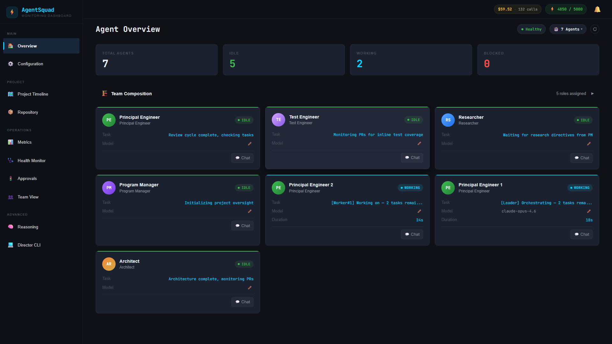
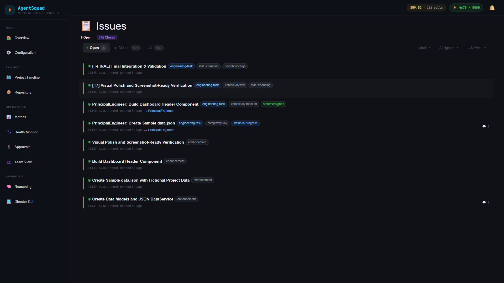
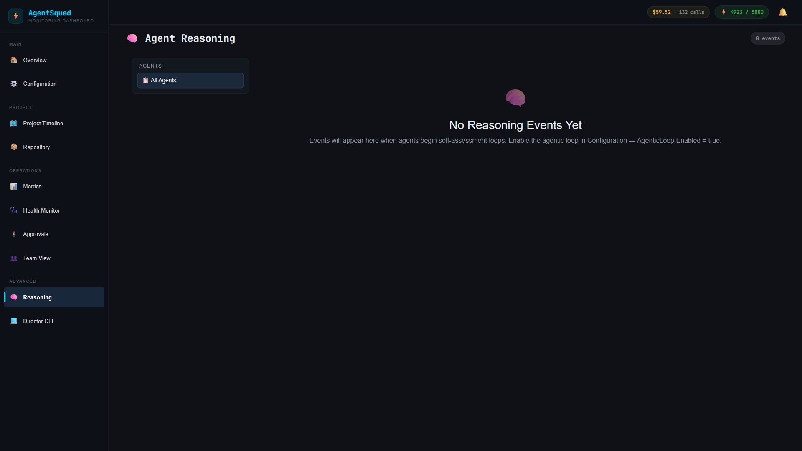
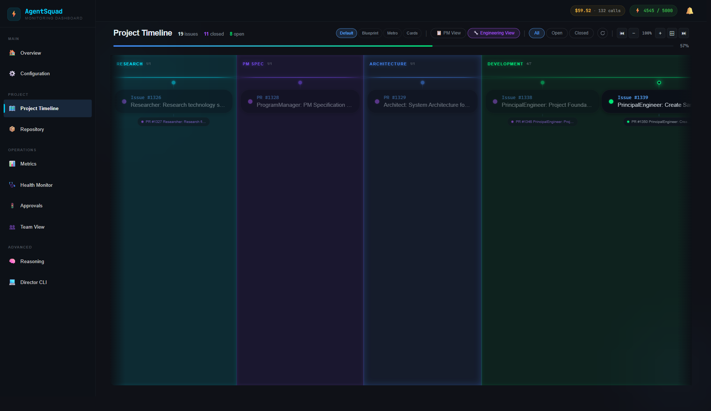
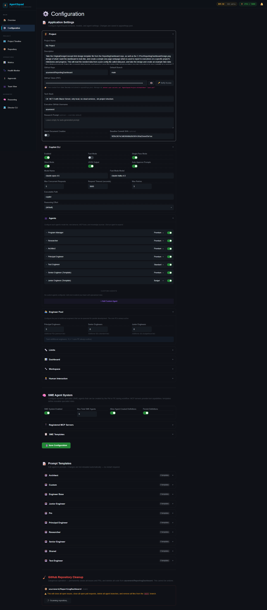
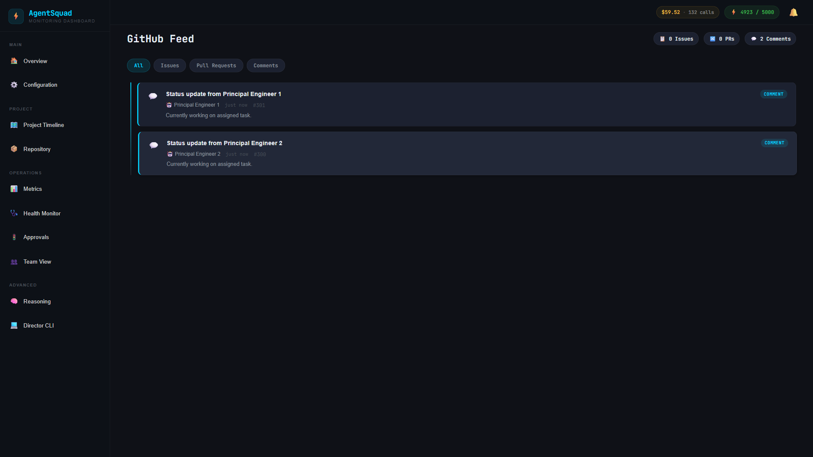
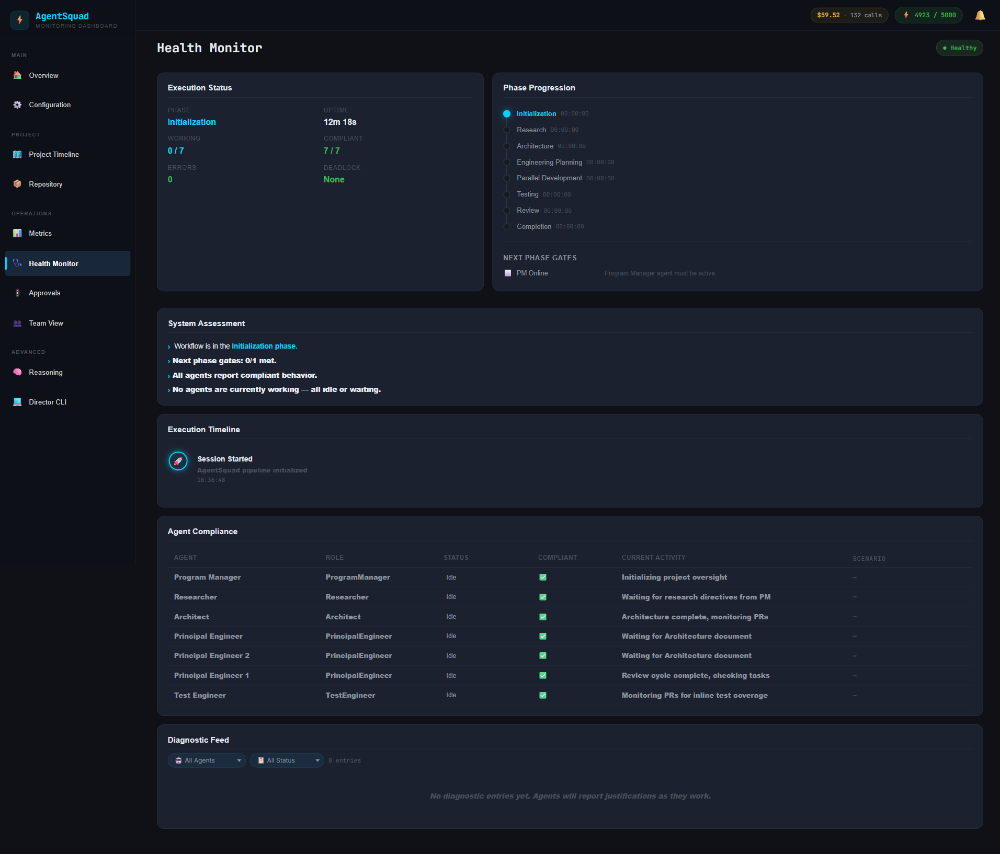
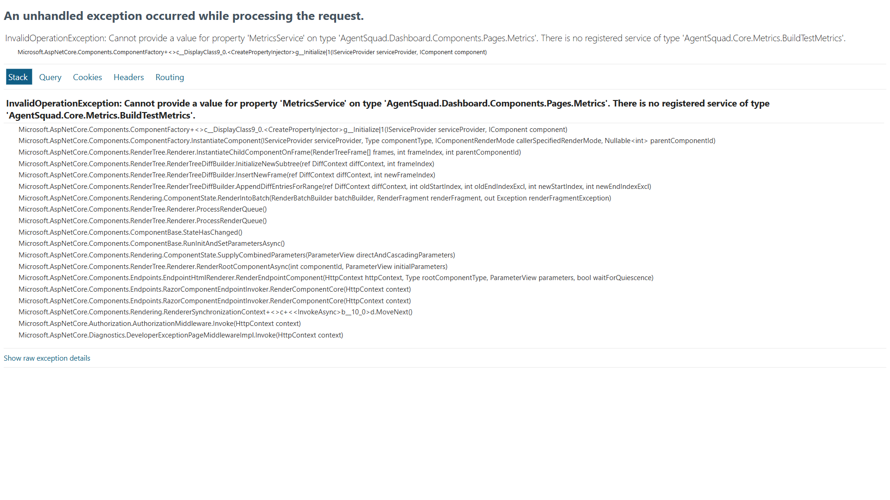
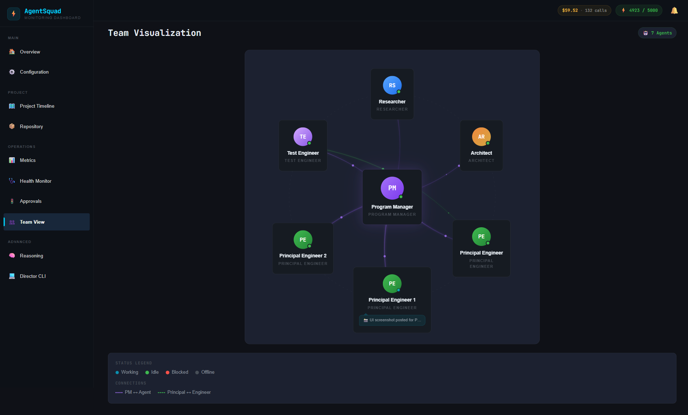
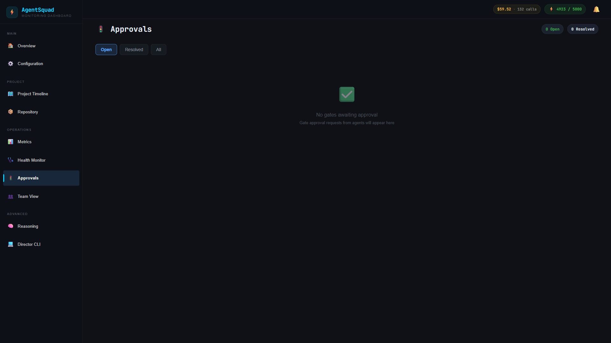

# Dashboard Scenario Test Results

> **Generated:** 2026-04-15
> **Dashboard:** http://localhost:5051 (standalone mode)
> **Runner:** http://localhost:5050 (API backend)
> **Browser:** Chromium (Playwright 1.52.0)
> **Resolution:** 1920×1080

## Summary

| Status | Count |
|--------|-------|
| ✅ Passed | 11 |
| ❌ Failed | 0 |
| **Total** | **11** |

## Scenarios

### S01: Agent Overview (`/`)
**Status:** ✅ PASSED

Validates: Agent cards visible, page has content, dark theme renders.



---

### S02: Pull Requests (`/pullrequests`)
**Status:** ✅ PASSED

Validates: PR cards display, state filters (Open/Closed/All), PR-related content present.


---

### S03: Issues (`/issues`)
**Status:** ✅ PASSED

Validates: Issue cards display, state filters, issue-related content present.



---

### S04: Agent Reasoning (`/reasoning`)
**Status:** ✅ PASSED

Validates: Reasoning log page renders with content.



---

### S05: Project Timeline (`/timeline`)
**Status:** ✅ PASSED

Validates: Timeline groups render, page has content.



---

### S06: Configuration (`/configuration`)
**Status:** ✅ PASSED

Validates: Configuration page has agent sections, settings, and config-related content.



---

### S07: GitHub Feed (`/github`)
**Status:** ✅ PASSED

Validates: GitHub activity feed renders with content.



---

### S08: Health Monitor (`/health`)
**Status:** ✅ PASSED

Validates: Health status page renders with content.



---

### S09: Metrics (`/metrics`)
**Status:** ✅ PASSED

Validates: Metrics page loads (accepts 500 in standalone mode as known limitation). Screenshot captured regardless of status.



---

### S10: Team Visualization (`/team`)
**Status:** ✅ PASSED

Validates: Team visualization page renders with content.



---

### S11: Approvals (`/approvals`)
**Status:** ✅ PASSED

Validates: Approval gates page renders with content.



---

## Test Infrastructure

- **Test Project:** `tests/AgentSquad.Dashboard.Tests/`
- **NuGet:** `Microsoft.Playwright 1.52.0`
- **Browser:** Chromium (non-headless, 1920×1080)
- **Video:** Recorded per browser context (`.webm` format)
- **Screenshots:** Full-page PNG captures

### How to Run

```bash
# Ensure dashboard (port 5051) and runner (port 5050) are running
dotnet test tests/AgentSquad.Dashboard.Tests

# Run a single scenario
dotnet test tests/AgentSquad.Dashboard.Tests --filter "S01"
```

### Known Limitations

- **Metrics page** (`/metrics`) returns 500 in standalone mode when certain data services are unavailable. Test accepts this gracefully.
- **Engineering Plan page** does not exist yet (no `/engineering-plan` route). Replaced with Agent Reasoning test.
- Tests require both Runner (API backend on 5050) and Dashboard (UI on 5051) to be running.
