<div align="center">

# 🎬 VirtualDevTeam — Interactive Walkthrough

**A visual tour of VDT's features — from project setup to PR delivery.**

*This walkthrough mirrors the interactive tour available at http://localhost:5050/walkthrough in the Dashboard.*

</div>

---

## 1. Welcome & Setup

`Zero-Config Auth`  `Prerequisite Check`

The Welcome wizard checks your prerequisites (Git, Node.js, .NET SDK) and configures authentication. No PAT tokens needed — VDT uses your already-logged-in tools like GitHub CLI, Copilot CLI, and Azure CLI for seamless, secure access.

<div align="center">
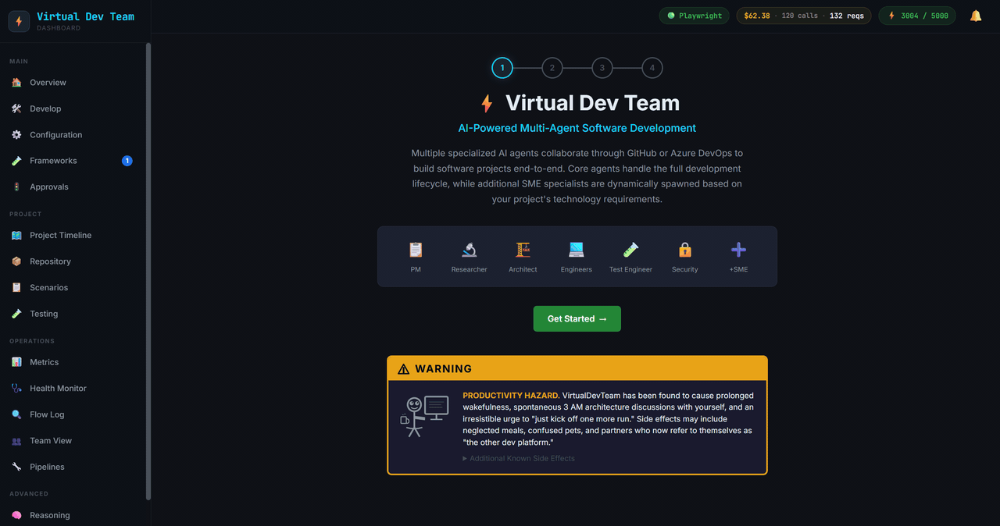
</div>

---

## 2. Authentication & AI Provider

`Multi-Platform`  `Flexible AI Providers`

Choose your dev platform (GitHub or Azure DevOps) and configure your OpenAI image model. VDT supports multiple platforms natively — switch between them without changing any agent code or workflows.

<div align="center">
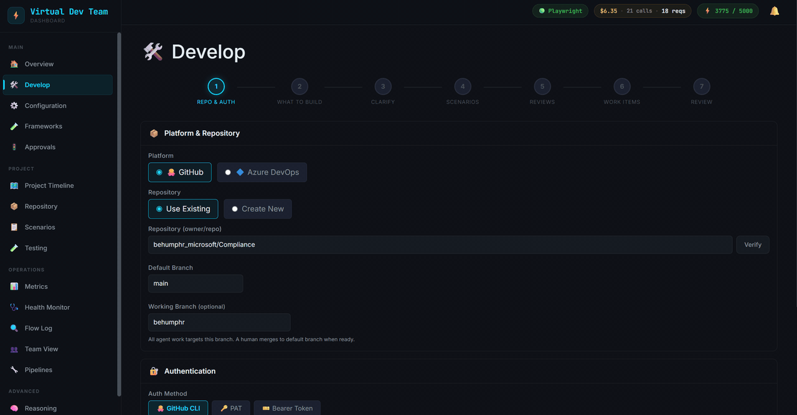
</div>

---

## 3. Project Description

`Natural Language Input`  `Auto-Generated Spec`

Describe your project in plain language. VDT's PM agent transforms your description into a comprehensive specification — complete with user stories, acceptance criteria, and technical requirements.

<div align="center">
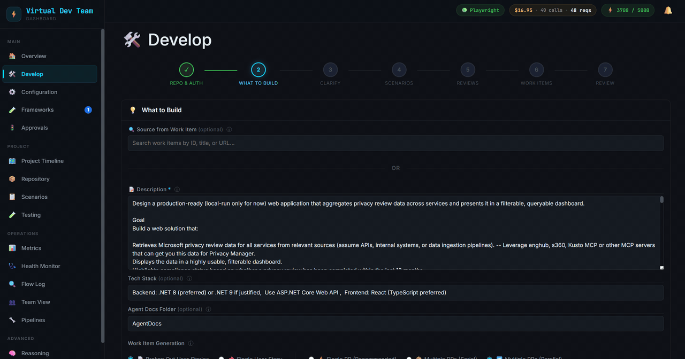
</div>

---

## 4. Clarifying Questions

`Gap Detection`  `Human Alignment`

Before building begins, agents generate clarifying questions with proposed answers to fill knowledge gaps. This ensures agents truly understand your vision before writing a single line of code.

<div align="center">
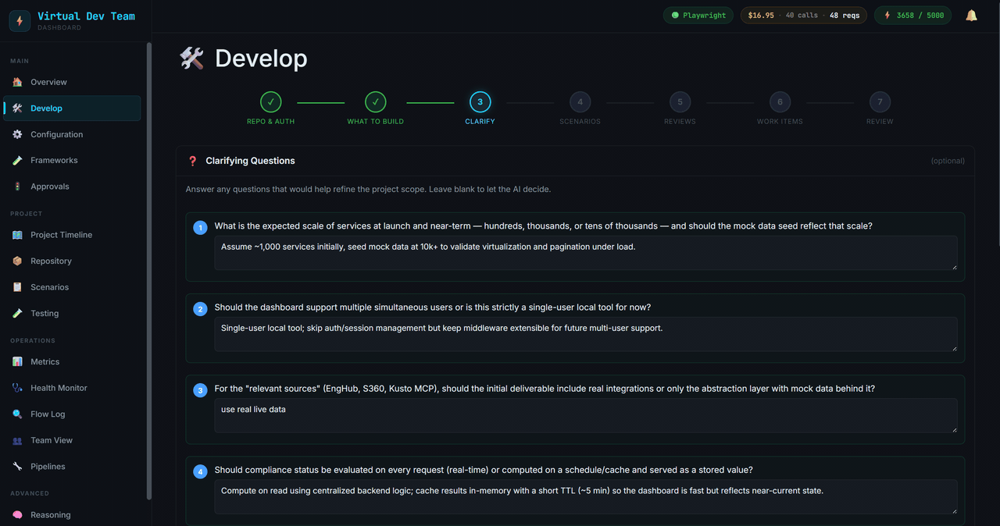
</div>

---

## 5. Scenarios

`Vision Tracking`  `PR Validation`

Scenarios are auto-generated from your project plan and validated throughout the entire build. Each PR is tested against these scenarios to ensure the final product matches your original vision.

<div align="center">
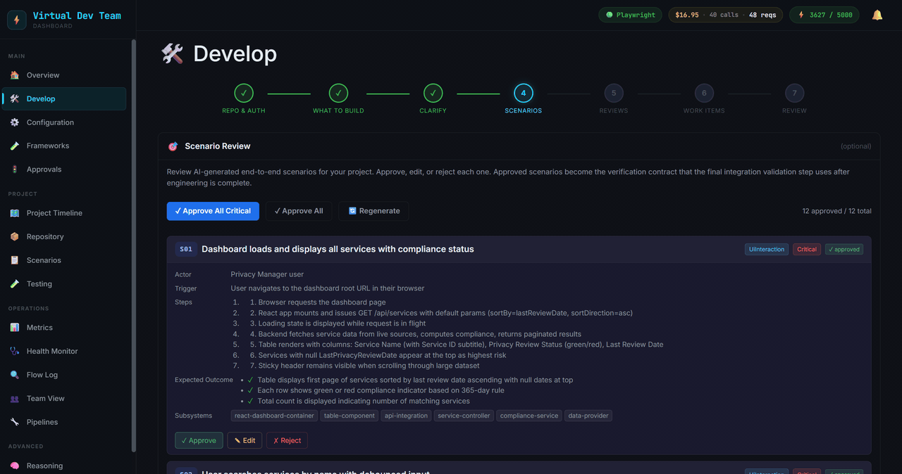
</div>

---

## 6. Review & Gating

`Human Gates`  `Expert Reviews`

Configure human approval gates at every stage of development. Peer reviews come from specialized, focused agents — each with domain expertise for architecture, testing, or business alignment.

<div align="center">
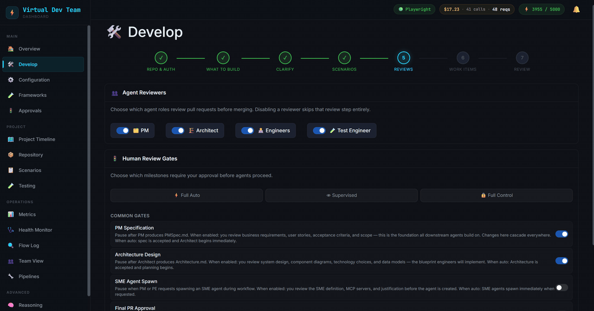
</div>

---

## 7. Work Item Generation

`Native Work Items`  `Dependency Tracking`

Engineering tasks are automatically created as native work items on your chosen platform (GitHub Issues or ADO Work Items) with full dependency tracking, wave-based execution, and acceptance criteria. Choose an optional parent work item to build from.

<div align="center">
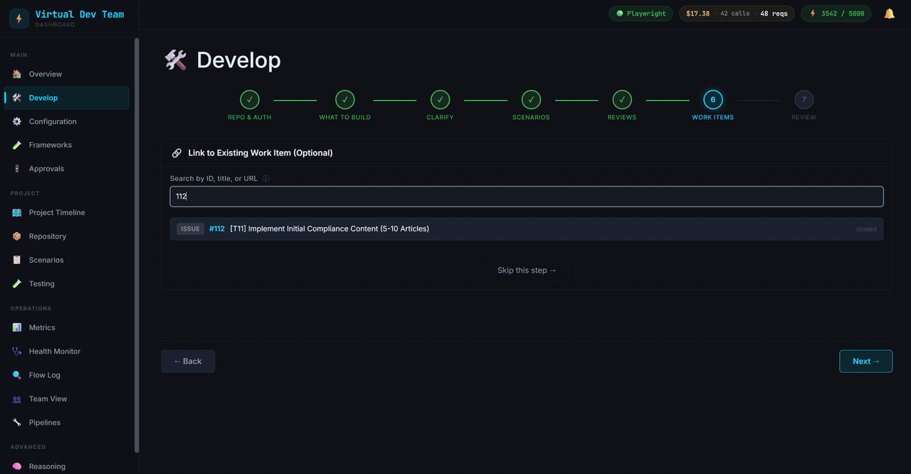
</div>

---

## 8. Review & Launch

`One-Click Launch`

Final review before agents start working. Approve the plan, adjust settings, and launch — your virtual development team begins autonomous collaboration immediately.

<div align="center">
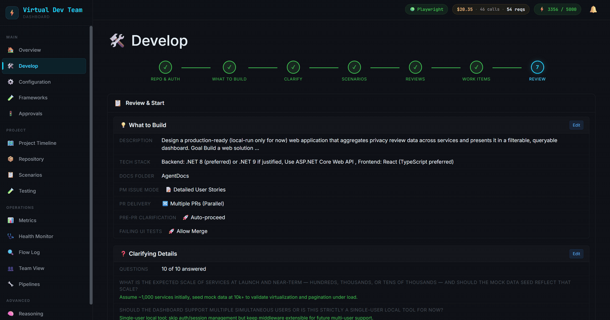
</div>

---

## 9. Overview Dashboard

`Live Status`  `Pre-PR Questions`

Live agent status cards show what each team member is doing in real-time. Agents ask clarifying questions before each PR for additional drill-down — you can review and edit their answers before implementation begins.

<div align="center">
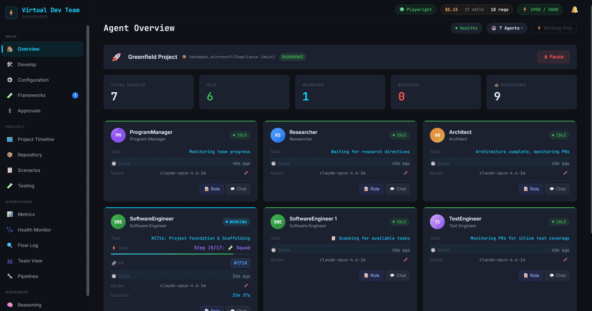
</div>

---

## 10. Project Timeline

`Full E2E Visibility`  `Phase Drill-Down`  `Media Preview`

Complete E2E visibility from Research through Completion. Drill into any phase to see individual PR progress, media artifacts, and milestone details — nothing is hidden from view.

<div align="center">
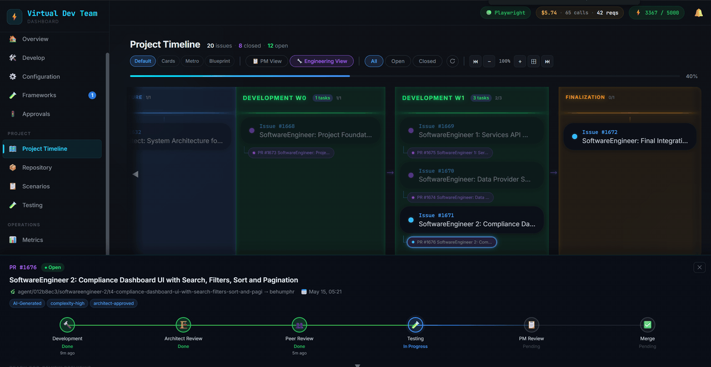
</div>

---

## 11. Agentic Frameworks

`Multi-Candidate`  `AI Judging`  `Image Generation`

Multiple Agentic frameworks tackle the same PR simultaneously using different approaches. A judge scores each candidate on quality and meeting the goals, then picks the winner. Images/gifs/videos are generated in real-time to view progress and help the judge.

<div align="center">
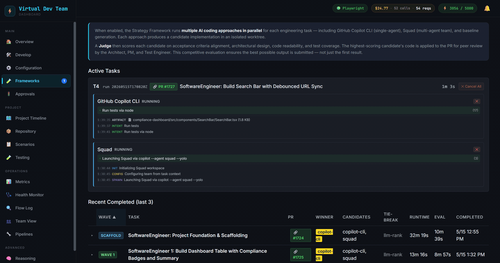
</div>

---

## 12. Reasoning & Decisions

`Decision Transparency`  `Reasoning Trail`

See exactly WHY agents made each decision. Progress steps, assessments, and architectural choices are logged and browsable — full transparency into the AI decision-making process. Set min decision levels to gate on and review for each PR.

<div align="center">
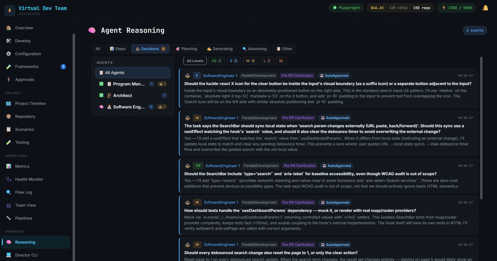
</div>

---

## 13. Repository Browser

`Unified View`  `Code Browser`  `Rendered Markdown`

Browse code, rendered documents, issues, and pull requests without leaving the dashboard. This integrated dev platform wrapper means you stay in one view for everything — no context switching to GitHub or ADO.

<div align="center">
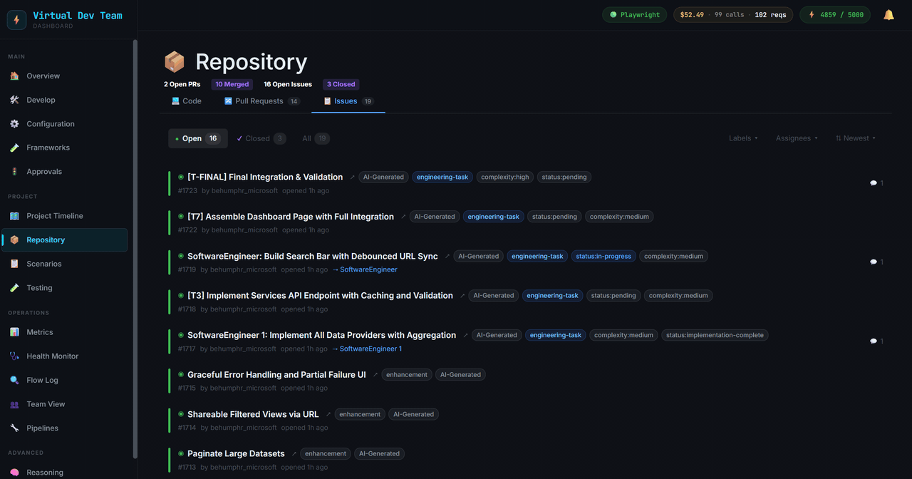
</div>

---

## 14. Scenario Tracking

`Scenario Coverage`  `PR Mapping`

Track scenario validation across the entire build. Drill down to see which PRs address which scenarios and their pass/fail status — ensuring the final product delivers on every requirement.

<div align="center">
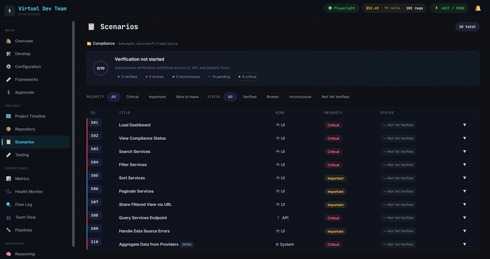
</div>

---

## 15. Team View

`Team Visualization`  `Future: 3D Environments`

Visualize your entire virtual team — who's working on what, their current status, and how they collaborate. Future releases will feature interactive 2D/3D team environments like virtual offices.

<div align="center">
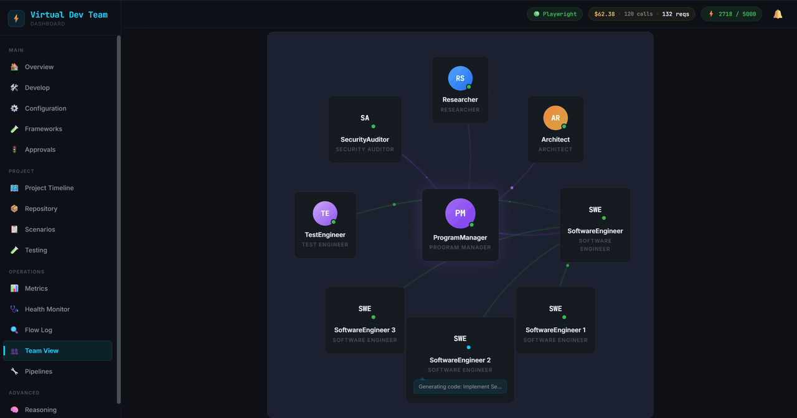
</div>

---

## 16. Pipelines

`CI/CD Integration`

Monitor CI/CD pipeline status and build health directly from the dashboard. Track build and deployment progress alongside your agent workflow for complete operational awareness.

<div align="center">
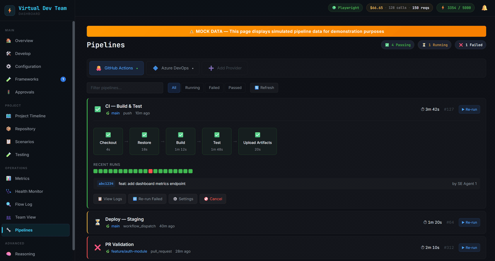
</div>

---

## 17. Health Monitor

`Stuck Detection`  `Auto-Escalation`

Automated watchdog detects stuck agents, phase mismatches, and workflow bottlenecks. Escalation ladders ensure issues get resolved — from automated nudges to human alerts with diagnostic checklists.

<div align="center">
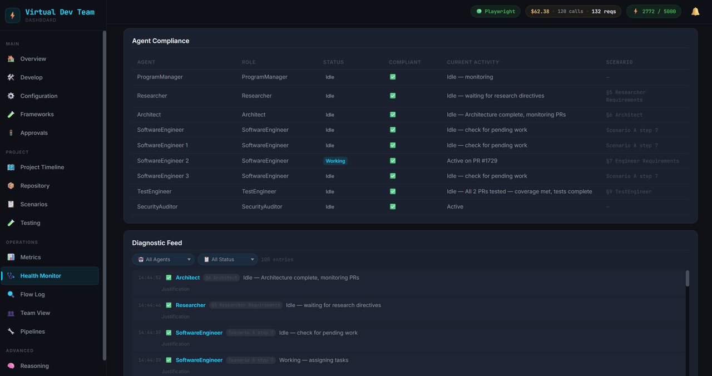
</div>

---

## 18. Metrics & Analytics

`Usage Analytics`  `Performance Tracking`  `Cost Visibility`

Detailed operational metrics track AI usage, token consumption, agent performance, and task throughput. Understand exactly how your virtual team is performing with comprehensive analytics.

<div align="center">
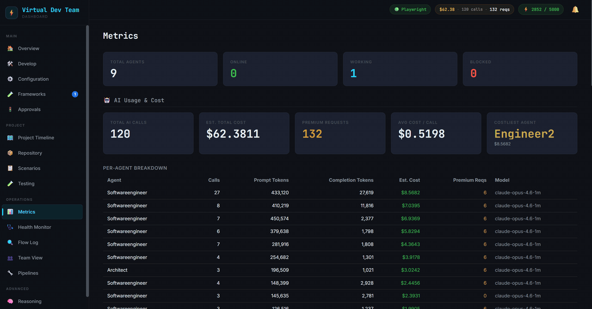
</div>

---

## 19. Configuration

`Custom Roles`  `Prompt Templates`  `MCP Integration`

Fully customize agent roles, prompt templates, model tiers, and MCP server integrations. Every aspect of agent behavior is configurable — from which AI models they use to how they operate effectively in their roles.

<div align="center">
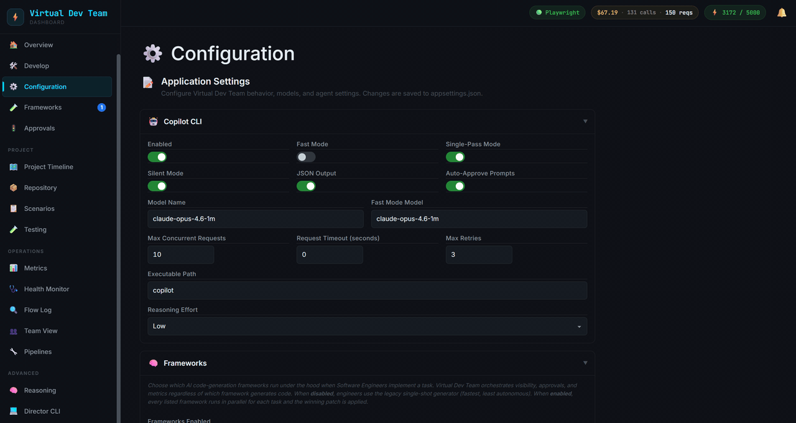
</div>

---

## 20. Director CLI

`Director Chat`  `Per-Agent Chat`

Chat directly with a Director agent to manage the entire buildout, or talk to individual agents for targeted guidance. It's like having a project manager and every team member on call.

<div align="center">
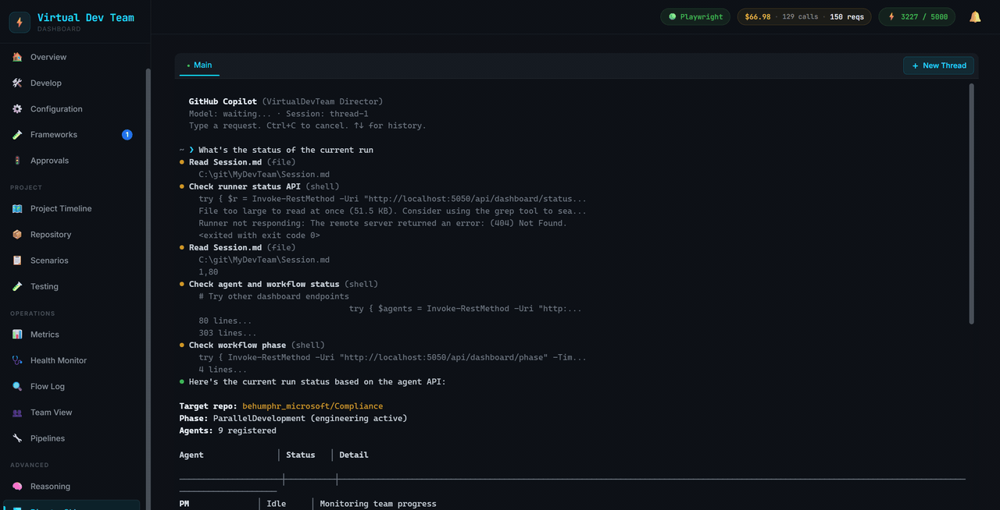
</div>

---

## 21. Testing & Preview

`Clone & Run`  `Visual Artifacts`  `Playwright Media`

Clone and run the project at any development stage with Preview Build. Browse all Playwright-generated screenshots, GIFs, and videos in one spot — visual proof of progress as agents work.

<div align="center">
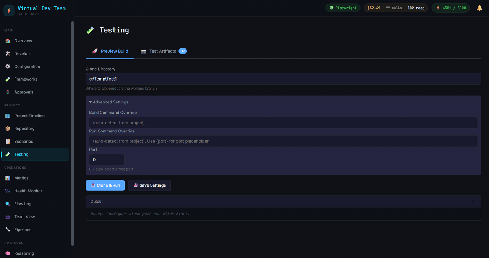
</div>

---

## 22. Flow Monitor

`Deadlock Detection`  `Diagnostic Enrichment`

Real-time watchdog with detector plugins that identify stuck states, deadlocks, and phase completion mismatches. Diagnostic enrichment explains WHY something is stuck — not just that it is.

<div align="center">
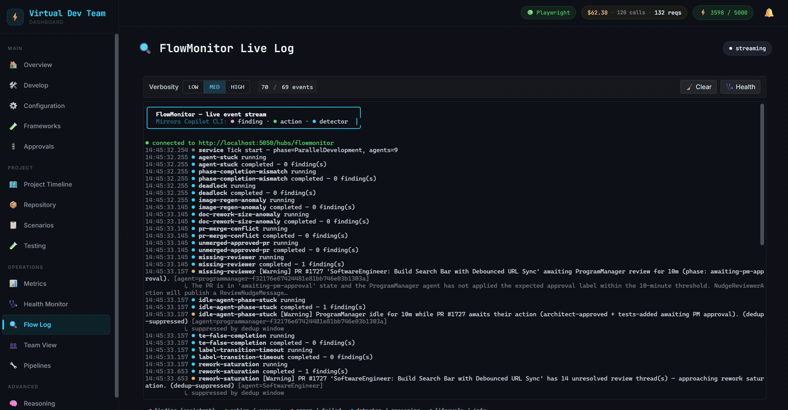
</div>

---

## 🚀 Try It Yourself
```bash
# Quick install
irm https://raw.githubusercontent.com/azurenerd/VirtualDevTeam/main/scripts/install.ps1 | iex

# Or run from source
cd src/VirtualDevTeam.Runner && dotnet run
```
Open http://localhost:5050/walkthrough for the interactive version with keyboard navigation and animations.
