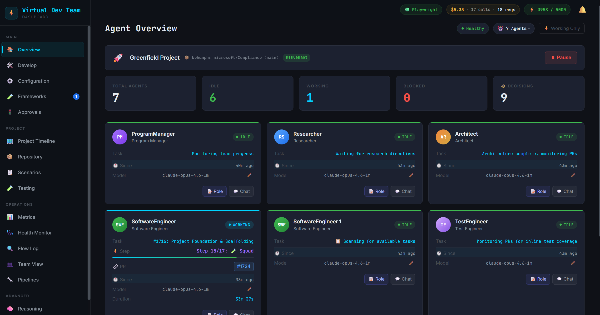
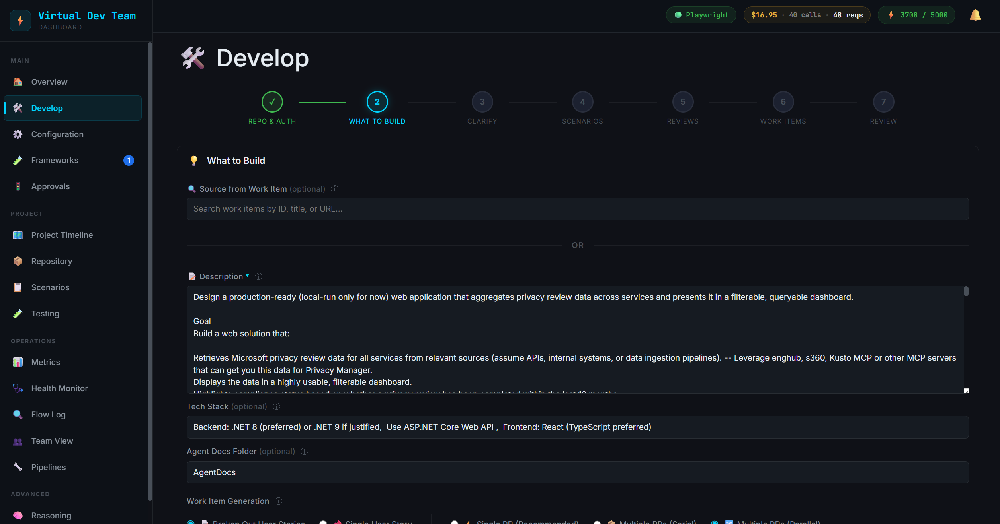
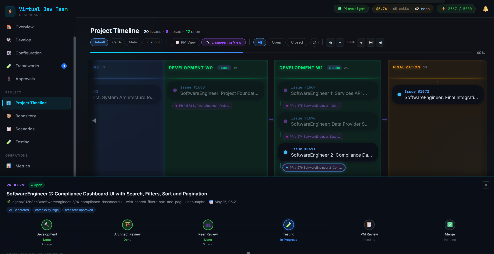
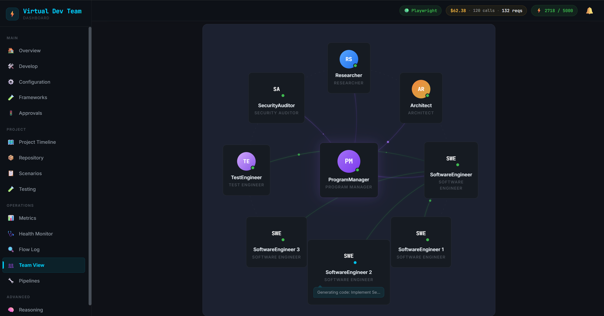
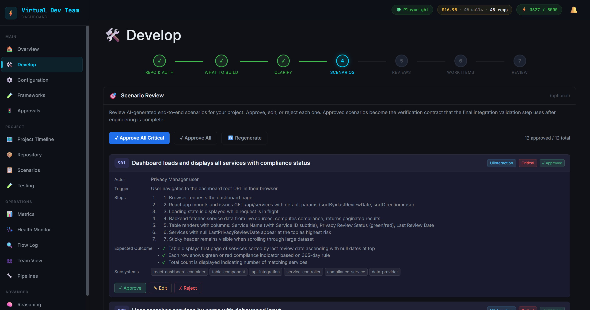

# 🤖 VirtualDevTeam — Newsletter (June 2026)

*An AI-powered autonomous development team that builds software end‑to‑end — with you in control.*

---

## What is it?

**VirtualDevTeam (VDT)** is an internal tool that spins up a simulated AI dev team on your local computer — Product Manager, Researcher, Architect, Software Engineers, Test Engineer, Security Auditor, plus specialists it spawns on demand. You give it a project description and a repo; it **researches → architects → plans → builds → tests → reviews → delivers**, producing real **GitHub/ADO PRs/Issues/Work Items**. A comprehensive dashboard lets you watch (screenshots/GIFs/videos) and steer every step, review every t-shirt size decision made, with configurable **human approval gates** for you to decide how much autonomy the team has.

🎥 **[▶ See the demo](https://microsoft-my.sharepoint.com/:v:/r/personal/behumphr_microsoft_com1/_layouts/15/stream.aspx?id=%2Fpersonal%2Fbehumphr_microsoft_com1%2FDocuments%2FVirtualDevTeamDemo.mp4&nav=eyJyZWZlcnJhbEluZm8iOnsicmVmZXJyYWxBcHAiOiJTdHJlYW1XZWJBcHAiLCJyZWZlcnJhbFZpZXciOiJTaGFyZURpYWxvZy1MaW5rIiwicmVmZXJyYWxBcHBQbGF0Zm9ybSI6IldlYiIsInJlZmVycmFsTW9kZSI6InZpZXcifX0%3D&share=cQp2Wya5R9IqSJS_u2qvNGhNEgUC2f6gqhbNUrsCTsKqUtL-ew)** &nbsp;·&nbsp; 🔗 **Find it at [aka.ms/VirtualDevTeam](https://aka.ms/VirtualDevTeam)**

---

## Why it exists

As the team was building with existing coding agents, the following key things were seen as gaps that could improve the experience, control, visibility and desired outputs:

1. **Focused-role agents** — PM, Researcher, Architect, Engineers, Test Engineer, Security Auditor and dynamically determined SME agents working together like a real team.
2. **Description + tech stack → a built solution** — you describe what you want; the team does the research and builds the PM/Arch specs to develop it.
3. **Zero → done with real Features / User Stories / Tasks** — full backlog plus PR/Issues in either GitHub, ADO or a simulated local mode (just one real final PR).
4. **The team reviews its own work** — agents critique each other by role and expertise and iterate on the feedback — and verify with real `build` / `test` / Playwright runs.
5. **Visibility into every step** — live progress from start to expected end, with screenshots/GIFs/videos of the work as it happens.
6. **Human gating at any major step** — review and give feedback *before* the team moves on; you choose how much autonomy it has.
7. **One place to see and manage it all** — a single visual dashboard to review and steer everything.

**What about solutions like Squad, GitHub CLI, Octane, or GasTown?** VDT is the **team + manager + governance + verification + dashboard** which can wrap around these and improve upon them, providing the human gating and deeper visibility and control that doesn't exist today. In fact, VDT uses **Squad** (and other engines) as *competing* implementations on the same task, then judges and merges the winner based on various scores like code quality, PM spec alignment and even visual quality scores. VDT integrates with your GitHub Copilot CLI backend (no API keys), Entra/`agency` wrapper + EMU‑friendly auth, GitHub **or** Azure DevOps, and a Local mode that submits one clean PR to your enterprise repo.

---

## Deeper Dive into Capabilities / Differentiators

### Multi-Agent Collaboration
- **Specialized Agent Roles**: 7+ agent types (PM, Researcher, Architect, Software Engineer, Test Engineer, Specialist/SME, Custom) each with domain expertise and focused responsibilities
- **Agent-to-Agent Communication**: Agents interact with each other, ask clarifying questions, and coordinate work through an in-process message bus + dev platform artifacts
- **Dynamic Specialist Spawning**: Specialist engineers (Frontend, Backend, Game Engine, Infra, etc.) are dynamically created based on project needs with slot-based concurrency limits
- **Team View**: Visual representation of the entire virtual team — who's working on what, their status, and how they collaborate. Future vision includes 2D/3D interactive team environments (office, house, etc.)

### Quality & Human Oversight
- **Human Gating at Every Step**: Configurable approval gates at every phase of development — from project planning through final PR merge. Nothing gets through without human sign-off if you want it.
- **Pre-PR Clarifying Questions**: Before each PR, agents generate up to 10 clarifying questions with proposed answers to validate assumptions and align with human expectations.
- **Project-Level Clarifying Questions**: At project start, the PM generates questions to ensure agents understand the plan and fill potential detail gaps.
- **Peer Reviews from Specialized Agents**: Focused code reviews from agents with specific expertise (architecture alignment, PM business review, test coverage, adversarial rework critique).
- **Scenario-Based Validation**: Scenarios are built from the project plan and used throughout the entire build to ensure each PR meets the original vision and passes scenario tests.
- **OWASP Top 10 Security Auditing**: A dedicated Security Auditor agent reviews changes against the **OWASP Top 10**, classifies findings by category (e.g., *A03 Injection*, *A07 Authentication Failures*), and blocks risky PRs from merging until they're resolved.

### Agentic Frameworks & Strategy
- **Multi-Agent Strategy Framework**: Multiple candidates work on the same task simultaneously using different approaches. A judge evaluates which candidate performed best.
- **Agentic Framework Judging**: AI judges score candidates 0-10 on acceptance criteria, design quality, readability and visuals (views Playwright screenshots) to pick winners.
- **Visual Progress Tracking**: Playwright generates screenshots, GIFs, and videos during development so you can see visual progress as agents work.

### Developer Experience
- **No PAT Tokens Required**: Uses already-logged-in tools (GitHub CLI, Copilot CLI, Azure CLI) for authentication. No need to generate, manage, or rotate Personal Access Tokens.
- **Multiple Dev Platform Support**: Native integration with both GitHub and Azure DevOps — work items, PRs, code reviews, and repository operations work on either platform.
- **Native Work Item Generation**: Automatically creates engineering task issues/work items on your chosen platform with full dependency tracking and wave-based execution.
- **Vertical-Slice Delivery**: Work is cut into self-contained **vertical slices** — each task delivers a feature end-to-end (UI + logic + styling + tests) that's demonstrable on its own, instead of "horizontal" layer-tasks (all the models, then all the services). Parallel engineers don't collide, and you never end up with broken half-built states between merges.
- **Clone & Run Preview at Any Stage**: Preview Build feature lets you clone and run the project at any point during development to see current state.
- **Director CLI**: Chat with a director agent that manages the entire buildout, or chat directly with individual agents to guide their work.

### Visibility & Monitoring
- **Full E2E Phase Timeline**: Complete visibility of the entire development lifecycle from Research through Completion, with drill-down into each phase and individual PR.
- **Reasoning & Decision Trail**: See exactly WHY agents made each decision — every reasoning step, every gate check, every choice is logged and browsable.
- **Dev Platform Wrapper**: Stay in the dashboard to browse code, documents, issues, and PRs without switching to GitHub/ADO — Repository page brings everything into one view.
- **Detailed Metrics & Logs**: Comprehensive operational metrics, usage statistics, and performance tracking for monitoring agent effectiveness.
- **Health Monitor & Flow Monitor**: Automated watchdog systems detect stuck agents, phase mismatches, and deadlocks — with escalation ladders for resolution.
- **Testing Artifacts in One Spot**: Browse all screenshots, videos, and Playwright traces from agent workspaces in a single Testing page.

### Customization
- **Fully Customizable Agent Roles**: Define custom agent roles with specific capabilities, model tiers, and behaviors.
- **Editable Prompt Templates**: ~100 prompt templates in editable Markdown files — customize how every agent thinks and communicates.
- **MCP Server Integration**: Add Model Context Protocol servers, and even lock specific agent roles to configured MCPs. 
- **Image Generation**: OpenAI integration for generating design mockups, art assets, and visual content during development.
- **Configurable Model Tiers**: Map agent roles to different AI model providers and tiers (premium/standard/budget/local) based on quality requirements.

### Future Vision
- **2D/3D Team Environments**: Interactive virtual workspaces where you can monitor and interact with your agent team in customizable environments (office, house, etc.).

---

## See it in action

| Develop wizard — describe what to build | Project timeline & waves |
|---|---|
|  |  |
| **The AI team** | **Scenarios — acceptance criteria** |
|  |  |

> 📖 Want the full tour? The dashboard has an **Interactive Walkthrough** (22 GIFs) at `https://localhost:5050/walkthrough` ([Markdown Link](https://github.com/azurenerd/VirtualDevTeam/blob/main/docs/Walkthrough.md)).

---

## Get started in ~2 minutes

Easiest and always up to date — let GitHub Copilot do the setup:

1. Create a folder, e.g. `C:\Git\VirtualDevTeam\`.
2. Open that folder in **GitHub Copilot (CLI or VS Code)** and say:
   > *"clone this repo https://github.com/azurenerd/VirtualDevTeam and run the solution"*
3. Open your browser to **[http://localhost:5050](http://localhost:5050)** (default port).
4. Click the **Develop** tab and start building.

*(Prefer a binary? `irm https://raw.githubusercontent.com/azurenerd/VirtualDevTeam/main/scripts/install.ps1 | iex`, then `vdt start`.)*

---

## June 2026 Improvements

A roundup of the most notable updates from the last month — focused on reliability, functionality, and visibility:

- **Smarter, calmer watchdog** — FlowMonitor's stuck-detection no longer false-alarms on legitimately long tasks, and now shows ✅/❌ checklists explaining *why* something is stuck.
- **More reliable scenario verification** — fixed false "Inconclusive" results; broken scenarios now route back to the engineer to fix and re-verify instead of silently stalling.
- **Built apps now ship with observability** — the architect and engineers are required to add proper logging, metrics, and error-surfacing, so the software VDT builds is diagnosable.
- **Intelligent UI testing** — Playwright tests now interact with the features that were actually built (forms, navigation), not just snap generic page screenshots.
- **Live agent log viewer & activity stream** — watch each agent's real-time output (Low/Med/High verbosity) and see what it's actually doing, right in the dashboard.
- **Agents read before they write** — engineers now explore the existing codebase first, so new code matches existing patterns and conventions.
- **Latest models + 1M context** — upgraded to Claude Opus 4.8 with a 1M long-context tier for higher-quality work on larger codebases.
- **Stability fixes** — resolved the Approvals page freeze, stopped rework loops on already-merged PRs, and fixed an HTTP client leak.
- **Local mode polish** — cleaner final-PR submission, config-drift handling, and correct PR links for enterprise / Local-platform users.
- **Now on .NET 10** — the platform was upgraded for performance and longevity, with zero regressions.

---

## Built with VirtualDevTeam

Internal projects started with and already using VDT:

- **📈 Project Reporting Dashboard** — [https://aka.ms/ProjectReporting](https://aka.ms/ProjectReporting), used to track many Trusted Platform projects' progress.
- **🛡️ Trusted Platform Compliance Intelligence (TPCI)** — Platform being built for running automated Privacy Reviews in the cloud.
- **🔁 Event‑Driven User Access Review (UAR)** — PoC exploring an event‑driven approach to reduce toil for quarterly access reviews.

---

## Learn more & get involved

- 🎥 **Demo:** [▶ Watch the VirtualDevTeam demo](https://microsoft-my.sharepoint.com/:v:/r/personal/behumphr_microsoft_com1/_layouts/15/stream.aspx?id=%2Fpersonal%2Fbehumphr_microsoft_com1%2FDocuments%2FVirtualDevTeamDemo.mp4&nav=eyJyZWZlcnJhbEluZm8iOnsicmVmZXJyYWxBcHAiOiJTdHJlYW1XZWJBcHAiLCJyZWZlcnJhbFZpZXciOiJTaGFyZURpYWxvZy1MaW5rIiwicmVmZXJyYWxBcHBQbGF0Zm9ybSI6IldlYiIsInJlZmVycmFsTW9kZSI6InZpZXcifX0%3D&share=cQp2Wya5R9IqSJS_u2qvNGhNEgUC2f6gqhbNUrsCTsKqUtL-ew)
- 📘 **README:** [github.com/azurenerd/VirtualDevTeam/blob/main/README.md](https://github.com/azurenerd/VirtualDevTeam/blob/main/README.md)
- 🎬 **Walkthrough:** [github.com/azurenerd/VirtualDevTeam/blob/main/docs/Walkthrough.md](https://github.com/azurenerd/VirtualDevTeam/blob/main/docs/Walkthrough.md)
- 🌐 **Home:** [https://aka.ms/VirtualDevTeam](https://aka.ms/VirtualDevTeam)
- 🙌 **Found a bug or have an improvement? Open a PR!** Contributions are very welcome.
- 💬 **Support / feedback:** **[behumphr@microsoft.com](mailto:behumphr@microsoft.com)**

*Give it a description — watch it research, build, test, and ship. Then tell us how to make it better.*
