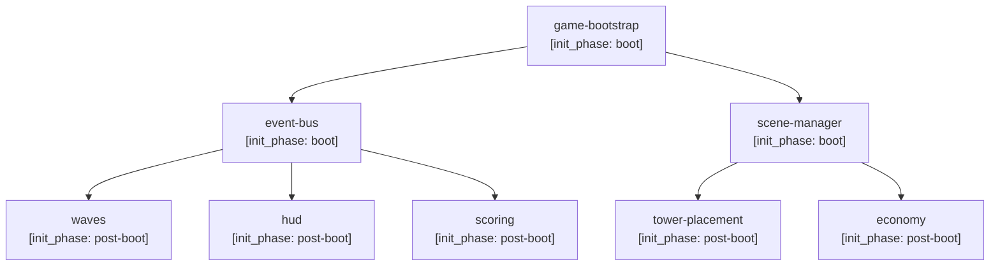

Now compile everything into a single, structured Architecture.md document with these exact sections:

# Architecture

## Overview & Goals
(High-level summary of the architecture and what it aims to achieve)

## System Components
(Each component with its responsibilities)

## Component Interactions
(Data flow and communication patterns between components)

## Data Model
(Entities, relationships, storage)

## Scenario → Component Map
Required table mapping every approved scenario to the components and features that implement it. Read the `# scenarios` YAML block in PMSpec to enumerate every approved scenario ID.

| Scenario | Components | Owner Wave |
|---|---|---|
| S01 | game-bootstrap, scene-manager | Wave 1 |
| S03 | tower-placement, economy, event-bus | Wave 2 |

**Architect instructions:**
- Every approved scenario in PMSpec's `# scenarios` YAML block MUST appear in this table.
- A scenario with no row here is an **architecture gap that blocks completion of the Architecture phase** — do not emit `architecture.complete` until all scenarios are covered.
- Infrastructure tasks (DB migrations, CI/CD, security hardening) are exempt; tag them `infrastructure: true` with a `for_scenarios: [SXX]` annotation in the table notes column instead of listing feature components.
- If a scenario spans multiple waves, list the primary implementing wave and note any partial-wave dependencies.

## Event Catalog
Required table cataloguing every event the system produces and consumes. Every event emitted or subscribed to in the codebase must appear here — no exceptions.

| Event | Emitter Component | Required Subscribers | Lifecycle Phase | Notes |
|---|---|---|---|---|
| game:started | game-modes | waves, hud, scoring | post-boot, after all features registered | must defer emission to next tick if any subscriber not yet registered |

**Architect instructions:**
- **Subscriber-without-emitter is an architecture error** (dangling subscription — the event can never fire). Block architecture completion.
- Emitter-without-subscriber is a **warning** (may be telemetry or a future extension point) — document the intent in the Notes column.
- Discovery primitives that imply ordering (`import.meta.glob`, assembly scanning, reflection-based discovery) **MUST** be paired with an explicit topological-sort declaration in this section. Implicit glob/scan order is not an acceptable ordering guarantee — the `## Feature Initialization Order` section must declare the authoritative sequence.
- **Canonical example of why this section exists:** The GridGuardians init-race bug (PR #1518 hotfix) was caused by `game:started` being emitted before wave/scoring subscribers had finished registering via `import.meta.glob` discovery. A declared Event Catalog with explicit lifecycle phases would have made the ordering constraint visible at architecture review time — and the TE would have generated a structural test asserting subscriber registration precedes emission.

## Feature Initialization Order
Required Mermaid diagram (or equivalent numbered ordered list if Mermaid is impractical) showing the deterministic topological initialization order across all features. Every component listed in `## System Components` must appear here with an `init_phase` annotation.



Valid `init_phase` values:
- `boot` — initialized synchronously before any user interaction is possible
- `post-boot` — initialized after the boot sequence completes, before the first app frame renders
- `first-user-interaction` — initialized lazily on the first user event (e.g. click, keypress, API call)
- `on-event` — initialized in response to a specific named event from the Event Catalog

**Architect instructions:**
- Order **must be deterministic** — alphabetic glob enumeration or discovery-scan order is **NOT** an acceptable ordering authority. The diagram here is the authority.
- **Cycles in the dependency graph are an architecture violation** and must be resolved (via introducing an intermediary, inverting a dependency, or extracting an interface) before the Architecture phase can complete.
- Every feature listed in this diagram that emits or subscribes to an event must have its `init_phase` consistent with the Lifecycle Phase column in `## Event Catalog` — mismatches are errors.

## API Contracts
(Endpoints, interfaces, request/response shapes)

## Infrastructure Requirements
(Hosting, networking, storage, CI/CD)

## Technology Stack Decisions
(Chosen technologies with justification)

## Security Considerations
(Auth, data protection, validation)

## Scaling Strategy
(How the system scales)

## Risks & Mitigations
(Key risks and how to address them)

## Architecture Contracts in Code
The `ARCH-CONTRACT:` comment annotation is the contract between this Architecture.md and the codebase. Every emit, subscribe, and initialization dependency in code MUST carry a matching annotation. A future `EventCatalogValidator` will scan source files for these annotations and cross-check them against the `## Event Catalog` and `## Feature Initialization Order` declared above.

**Emit annotation:**
```
// ARCH-CONTRACT: emits=game:started subscribers=[waves,hud,scoring] phase=post-boot
function startGame() { ... }
```

**Subscribe annotation:**
```
// ARCH-CONTRACT: subscribes=game:started owner=waves
eventBus.on('game:started', ...)
```

**Initialization dependency annotation:**
```
// ARCH-CONTRACT: init_phase=post-boot depends-on=[event-bus,scene-manager]
class WaveManager { ... }
```

**Rules for engineers** (the architect must include these rules verbatim in each engineering task issue that touches an event emitter or subscriber):
1. An emitter annotation **must list all required subscribers** exactly as they appear in the Event Catalog row for that event.
2. A subscriber annotation **must match the emitter's declared `phase`** — if the emitter fires at `post-boot`, every subscriber must be fully initialized by `post-boot`.
3. Annotations missing from a function that emits or subscribes to a catalogued event constitute an architecture violation; the `EventCatalogValidator` (future static-analysis gate) will treat their absence as a PR-blocking finding.
4. Intentional exceptions (telemetry events, future extension points with no current subscribers) must carry: `// ARCH-CONTRACT: emits=<event> subscribers=[] reason=telemetry-only` so the validator knows to emit a warning rather than an error.

Use these exact section headers. Be thorough and specific. This document will be the single source of truth for the engineering team.
